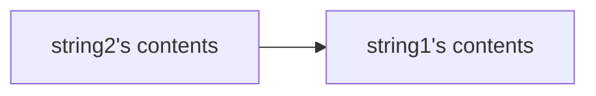

## List of Contents

- [[C String Functions#What to Include? | What to Include?]]
	- [[C String Functions#`strlwr()` Function | strlwr() Function]]
	- [[C String Functions#`strupr` Function | strupr() Function]]
	- [[C String Functions#`strcat` Function | strcat() Function]]
		- [[C String Functions#`strncat` Function with Number of Character From the <em style="color yellow;">Second</em> String | strncat() Function]]
	- [[C String Functions#`strcpy` Function | strcpy() Function]]
		- [[C String Functions#`strncpy` Function with Number of Character From the <em style="color yellow;">Second</em> String | strncpy() Function]]
	- [[C String Functions#`strset` Function | strset() Function]]
		- [[C String Functions#`strnset` Function | strnset() Function]]
	- [[C String Functions#`strrev` Function | strrev() Function]]
	- [[C String Functions#`strlen` Function | strlen() Function]]
	- [[C String Functions#`strcmp` Function | strcmp() Function]]
		- [[C String Functions#`strncmp` Function | strncmp() Function]]
	- [[C String Functions#`strcmpi` Function | strcmpi() Function]]
		- [[C String Functions#`strnicmp` Function | strnicmp() Function]]

---

### My Links

 - [[C String Functions#Socials | Links to Socials]]

---

# String Functions

>[!note]- A Little Note
>This notes will not be really about explaining things ( *nevertheless, I will be making offensive jokes* ).
>Rather, you just have to code it and see the results for yourself.

## What to Include?

To be able to perform some of these operations down below $\downarrow$. We will need to call the library `string.h`. Hence, at the start of every code that we know we are going to be using *string functions*; we need to add the header.

```C

// Adding the library `string.h`
#include <string.h>

```

>[!warning]
>If you do **not** include this library, then you will not be able to perform these string functions.

## `strlwr()` Function

So what is this function? What a weird-ass name to it. Lets break it down for someone that has only 1 brain cell can understand.

So `strlwr`, we can break this word into 2 pieces ( *not really* ). We have **string** ( *not the thing that you wear* ) and **lower**. I think you get the idea... So lets go see the fucking code.

### Example 1: "*Lowering*" ( *haha* ) Words

```C

// Include standard input / output header
#include <stdio.h>
// Include string library / header
#include <string.h>

int main()

{

  // Declaration

  // DECLARE text1: STRING ( size = 9 )
  char text1[] = "Shit Box";
  
  // Output original texts / strings
  printf("\nOriginal Text: %s", text1);

  // Make text1 Lowercased
  strlwr(text1);

  // Output the result
  printf("\nLowercased: %s", text1);

  // Even if we print `text1` again, its in memory
  printf("\nText 1 ( saved in memory ): %s\n", text1);

  return 0;

}

```

### Example 2: We can even do it inside `printf` function!

```C

// Include standard input / output header
#include <stdio.h>
// Include string library / header
#include <string.h>

int main()

{

  // Declaration

  // DECLARE cap_letters: STRING ( size = 8 )
  char cap_letters[] = "ABCDEFG";
  // DECLARE name: STRING ( size = 15 )
  char name[] = "Lewis Hamilton";

  // Example 1:
  printf("\nUppercase Letters: %s", cap_letters);
  printf("\nLowercased Letters ( Capital Letters ): %s", strlwr(cap_letters));
  // Example 2:
  printf("\nName ( Original ): %s", name);
  printf("\nName ( Lower Cased ): %s\n", strlwr(name));

  return 0;

}

```

## `strupr` Function

What is the opposite of `strlwr`? The answer is ( *insert drum roll here* ): `strupr`!

>I hope you understood this; else I need to go to the asylum!

### Example 1: "*Uppering*" ( *stfu its my notes* ) Some Words

```C

// Include standard input / output header
#include <stdio.h>
// Include string library / header
#include <string.h>

int main()

{

  // Declaration

  // DECLARE text1: STRING ( size = 22 )
  char text1[] = "goat = Lewis";
  
  // Output original texts / strings
  printf("\nOrignal Text: %s", text1);

  // Make text1 Uppercased
  strupr(text1);

  // Output the result
  printf("\nUppercased: %s", text1);

  // Even if we print `text1` again, its in memory
  printf("\nText 1 ( saved in memory ): %s\n", text1);

  return 0;

}

```

### Example 2: Again using it inside `printf` function

```C

// Include standard input / output header
#include <stdio.h>
// Include string library / header
#include <string.h>

int main()

{

  // Declaration

  // DECLARE lower_letters: STRING ( size = 8 )
  char lower_letters[] = "abcdefg";
  // DECLARE id: STRING ( size = 9 )
  char id[] = "fuckyou!";
  
  // Example 1:
  printf("\nLowercased Letters: %s", lower_letters);
  printf("\nUppercased Letters ( Lowercased Letters ): %s", strupr(lower_letters));
  // Example 2:
  printf("\nID ( Original ): %s", id);
  printf("\nID ( Uppercased ): %s\n", strupr(id));

  return 0;

}

```


## `strcat` Function

As the function name suggest; it will **concatenate** 2 strings together. But not in the way that you think.

>I lied to myself, there is explaining to do 😢

When you use:

```C

strcat(string1, string2);

```

- Where `string1` and `string2` are variables holding some *string* ( *again not the thing that you wear* )

The variable `string1` will take the **final value**. What I mean by final value?

#### For Example: `strcat`

If you have:

- `string1` = "FUCK"
- `string2` = "YOU BITCH"

We do <span style="color: red;">not</span> need another variable to hold the concatenated string. Meaning that:

- `string1` = "FUCKYOU BITCH"

>[!warning]
>This also applies to the other functions like `strlwr` and `strupr`.
>But I did not know it until right fucking now!

```C

// Include standard input / output header
#include <stdio.h>
// Include string library / header
#include <string.h>

int main()

{

  // Declaration

  // DECLARE text1: STRING ( size = 5 )
  char text1[] = "cat=";
  // DECLARE text2: STRING ( size = 6 )
  char text2[] = "pussy";

  // Output original texts / strings
  printf("\nText 1: %s", text1);
  printf("\nText 2: %s", text2);

  // Concatenate text1 with text2
  strcat(text1, text2);

  // Variable `text1` becomes the full word
  printf("\nFinal Word: %s", text1);

  // Even if we print `text1` again, its in memory
  printf("\nText 1 ( saved in memory ): %s\n", text1);

  return 0;

}

```

>[!note]
>You can only concatenate **2 Strings**.

## `strncat` Function with Number of Character From the <em style="color: yellow;">Second</em> String

Basically the same thing ( *but not `strcat` but <code>str<span style="color: red;">n</span>cat</code>* ) as above but now we can **choose** the number of *letters* to take from `string2`.

>Again, this is something that need to be done, nevertheless, if you do not understand anything; Google, YouTube University and ChatGPT is still here!

```C

// Include standard input / output header
#include <stdio.h>
// Include string library / header
#include <string.h>

int main()

{

  // Declaration

  // DECLARE text1: STRING ( size = 25 )
  char text1[25] = "Hello";
  // DECLARE text2: STRING ( size = 15 )
  char text2[] = " World is Shit";
  
  // Concatenate only the word 'World'
  strncat(text1, text2, 6);

  // Output the result of concatenation
  printf("\nFinal Text is: %s", text1);

  // Even if we print `text1` again, its in memory
  printf("\nText 1 ( saved in memory ): %s\n", text1);

  return 0;

}

```

## `strcpy` Function

So do I need to break this down for people who have only and only 1 brain cell like ME??? NO!!! ( *because I am fucking tired* )

>Just forget the first line.

This function will copy a string from one variable to the other. Let me explain again with the method [[C String Functions#For Example `strcat`| above]] $\uparrow$

#### For Example : `strcpy`

If you have:

- `string1` = "The World Is a Nice Place"
- `string2` = "The World Is a Bad Place"

Then if you use the `strcpy()` like so: `strcpy(string1, string2)`;

- It will copy the content of *string2* **to** *string1*



This means that the contents of `string1` gets <span style="color: red">destroyed</span>!

```C

// Include standard input / output header
#include <stdio.h>
// Include string library / header
#include <string.h>

int main()

{

  // Declaration

  // DECLARE text1: STRING ( size = 30 )
  char text1[30] = "The World is a Nice Place";
  // DECLARE text2: STRING ( size = 35 )
  char text2[35] = "The World is a Shit Place to Live";

  // Output the original values of variables
  printf("\nText 1: %s", text1);
  printf("\nText 2: %s", text2);
  
  // Copy only the word 'World'
  strcpy(text1, text2);
  
  printf("\n");

  // Output the result of copy
  printf("\nFinal Text is: %s\n", text1);
  printf("\nText 2 is still the same: %s", text2);

  // Even if we print `text1` again, its in memory
  printf("\nText 1 ( saved in memory ): %s\n", text1);

  return 0;

}

```

## `strncpy` Function with Number of Character From the <em style="color: yellow;">Second</em> String

Similar to the function [[C String Functions#`strncpy` Function with Number of Character From the <em style="color yellow;">Second</em> String | strncat()]], but now with <code>str<span style="color: red;">n</span>cpy</code>.

```C

// Include standard input / output header
#include <stdio.h>
// Include string library / header
#include <string.h>

int main()

{

  // Declaration

  // DECLARE text1: STRING ( size = 15 )
  char text1[15] = "      Fuck You";
  // DECLARE text2: STRING ( size = 10 )
  char text2[10] = "Bitch Ass";

  // Output the original values of variables
  printf("\nText 1: %s", text1);
  printf("\nText 2: %s", text2);
  
  // Copy only the word 'Bitch'
  strncpy(text1, text2, 5);
  
  printf("\n");

  // Output the result of copy
  printf("\nFinal Text is: %s", text1);

  // Even if we print `text1` again, its in memory
  printf("\nText 1 ( saved in memory ): %s\n", text1);

  return 0;

}

```

## `strset` Function

>[!tip]- Why, Why? Actually why the fuck do we need this?
>I might be saying this right now, but I think this can come up in an exam. Bro I am telling you.
>When I was learning how to reverse strings in [[Python]], I was like this.
>I need to reverse a string in my final Computer Science exam at school 🤯.

It will replace all the characters in a string with something else that you decide.

```C

// Include standard input / output header
#include <stdio.h>
// Include string library / header
#include <string.h>

int main()

{

  // Declaration

  // DECLARE password: STRING ( size = 12 )
  char password[] = "Hello World";

  // Output the original value of variable
  printf("\nPassword: %s", password);
  
  // Replace password with character '*'
  strset(password, '*');
  
  // Output the result of "censoring"
  printf("\nWTF Happened: %s", password);

  return 0;

}

```

## `strnset` Function

I think you know where this is going! Basically the same fucking thing as above $\uparrow$ but instead we can change a specific number of letters / characters.

```C

// Include standard input / output header
#include <stdio.h>
// Include string library / header
#include <string.h>

int main()

{

  // Declaration

  // DECLARE shit: STRING ( size = 9 )
  char shit[] = "Fuck You";

  // Output the original value of variable
  printf("\nOriginal: %s", shit);
  
  // Replace Fuck with character '*'
  strnset(shit, '*', 4);
  
  // Output the result of censoring
  printf("\nCensored: %s", shit);

  return 0;

}

```

## `strrev` Function

No, there are no cars revving. Heck this is not about cars and [Gears and Gasoline](https://www.youtube.com/@GearsandGasoline) ( *fucking GREAT channel* )

In [[Python]] if you have for example a string we can easily reverse it like so:

```python

# DECLARE greet: STRING ---> What A Breeze not some fucking array, char shit!
greet = "olleH"

# Output in reversed
print(greet[::-1])

```

>Just wanting to write some Python Code. Go Fuck Yourself for telling me that I cannot put Python Code inside C notes.

Below we are going to continue with our C Programming

```C

// Include standard input / output header
#include <stdio.h>
// Include string library / header
#include <string.h>

int main()

{

  // Declaration

  // DECLARE name: STRING ( size = 9 )
  char name[] = "drahciR";

  // Output the original value of variable
  printf("\nOriginal: %s", name);
  
  // Reversing the user's name
  strrev(name);
  
  // Output the result of reversing
  printf("\nActual Name: %s", name);
  
  return 0;

}

```

>[!note]
>All the functions below will be of type **Integer**

## `strlen` Function

This function will return the **length** of the string, just like in [[String Manipulation - Python#Length Function | Python's Length Function]]

Here is the code below $\downarrow$:

```C

// Include standard input / output header
#include <stdio.h>
// Include string library / header
#include <string.h>

int main()

{

  // Declaration

  // DECLARE name: STRING ( size = 11 )
  char name[] = "S.Sunhaloo";
  // DECLARE car_make: STRING ( size = 6 )
  char car_make[] = "Mazda";

  // Find the length of the variables
  // NOTE: We need to make another variable to hold the length
    // This is because the length is of type INTEGER, Duh!?!
  // DECLARE len_name: INTEGER
  int len_name = strlen(name);
  // DECLARE len_car_make: INTEGER
  int len_car_make = strlen(car_make);

  // Output the result of strlen() function
  printf("\nLength of Name: %d", len_name);
  printf("\nLength of Car Make: %d\n", len_car_make);

  return 0;

}

```

## `strcmp` Function

What does this do now? You ask, well this will **compare** 2 strings; let me show / explain.

Suppose we have 4 strings:

- `string1` = "S.Sunhaloo"
- `string2` = "S.Sunhaloo"
- `string3` = "The Same?"
- `string4` = "Yeah, NOT the same!"

If you apply the compare function like so:

```C

int result_same = strcmp(string1, string2);

```

The result ( *ha the result* ) of `result_name` will be **0**!

Now, If you have use it with `string3` and `string4`, then we will have a different story, here we go:

```C

int result_diff = strcmp(string3, string4);

```

This would output some number ( *normally that number should be 1 or -1 - don't ask me why it changes, I tested the code, and it does seem to change the number* ) and **not** 0!

Hence we have:

<p align="center">Same Contents in String => Return Value = 0</p>
<p align="center">Different Contents in String => Return Value != 0</p>

Here is an example with `if` statements

```C

// Include standard input / output header
#include <stdio.h>
// Include string library / header
#include <string.h>

int main()

{

  // Declaration

  // DECLARE name1: STRING ( size = 11 )
  char name1[] = "S.Sunhaloo";
  // DECLARE name2: STRING ( size = 11 )
  char name2[] = "S.Sunhaloo";
  // DECLARE not_same1: STRING ( size = 6 )
  char not_same1[] = "Same?";
  // DECLARE not_same2: STRING ( size = 9 )
  char not_same2[] = "Not Same";

  // Comparing all characters in string
  int result1 = strcmp(name1, name2);
  int result2 = strcmp(not_same1, not_same2);

  // If result1 is the same
  if(result1 == 0){
    printf("\nThe Variables Have The Same Value!");
  }
  else{
    printf("\nThe Variables Does NOT Have The Same Value!");
  }
  // If result2
  if(result2 == 0){
    printf("\nThe Variables Have The Same Value!");
  }
  else{
    printf("\nThe Variables Does NOT Have The Same Value!");
  }

  return 0;

}

```

## `strncmp` Function

Do I need to write things here, I think you get the idea that this will compare a set amount of character / letters in the string ( *provided by the programmer* )

>For real, amma not waste too much time and just change the above code so that we have use it here.
```C

// Include standard input / output header
#include <stdio.h>
// Include string library / header
#include <string.h>

int main()

{

  // Declaration

  // DECLARE name1: STRING ( size = 11 )
  char name1[] = "S.Sunhaloo";
  // DECLARE name2: STRING ( size = 11 )
  char name2[] = "S.Sunhaloo";
  // DECLARE not_same1: STRING ( size = 6 )
  char not_same1[] = "Same?";
  // DECLARE not_same2: STRING ( size = 9 )
  char not_same2[] = "Not Same";

  // Comparing only 4 characters in string
  int result1 = strncmp(name1, name2, 4);
  int result2 = strncmp(not_same1, not_same2, 4);

  // If result1 is the same
  if(result1 == 0){
    printf("\nThe Variables Have The Same Value!");
  }
  else{
    printf("\nThe Variables Does NOT Have The Same Value!");
  }
  // If result2
  if(result2 == 0){
    printf("\nThe Variables Have The Same Value!");
  }
  else{
    printf("\nThe Variables Does NOT Have The Same Value!");
  }

  return 0;

}

```

## `strcmpi` Function

This is similar to `strcmp()` Function, but this time; it will **ignore** all cases.

Take a look at the code below $\downarrow$

```C

// Include standard input / output header
#include <stdio.h>
// Include string library / header
#include <string.h>

int main()

{

  // Declaration

  // DECLARE object1: STRING ( size = 4 )
  char object1[] = "Sun";
  // DECLARE object2: STRING ( size = 4 )
  char object2[] = "sun";

  // Comparing all characters in string
    // Compare character with `strcmp` Function ( Does NOT Ignore Case )
  int result_case = strcmp(object1, object2);
    // Compare character with `strcmpi` Function ( DOES Ignore Case )
  int result_ignore_case = strcmpi(object1, object2);

  // Output the results
  printf("\nResult Without Ignore Case: %d", result_case);
  printf("\nResult With Ignoring Case: %d\n", result_ignore_case);

  return 0;

}

```

## `strnicmp` Function

Like what do you want me to do, shove some code down your throat and do not explain anything? Okay if that's what you want then...

```C

// Include standard input / output header
#include <stdio.h>
// Include string library / header
#include <string.h>

int main()

{

  // Declaration

  // DECLARE object1: STRING ( size = 4 )
  char object1[] = "Sun";
  // DECLARE object2: STRING ( size = 4 )
  char object2[] = "sun";

  // Comparing only 2 characters in string
    // Compare character with `strncmp` Function ( Does NOT Ignore Case )
  int result_case = strncmp(object1, object2, 2);
    // Compare character with `strnicmp` Function ( DOES Ignore Case )
  int result_ignore_case = strnicmp(object1, object2, 2);

  // Output the results
  printf("\nResult Without Ignore Case: %d", result_case);
  printf("\nResult With Ignoring Case: %d\n", result_ignore_case);

  return 0;

}

```


>[!success] We are finally done with this!

---

# Socials

- [**Instagram**](https://www.instagram.com/s.sunhaloo/)
- [**YouTube**](https://www.youtube.com/channel/UCMkQZsuW6eHMhdUObLPSpwg)
- [**GitHub**](https://www.github.com/Sunhaloo)

---

S.Sunhaloo
Thank You!