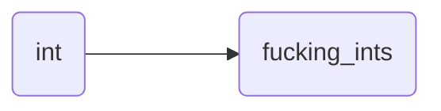
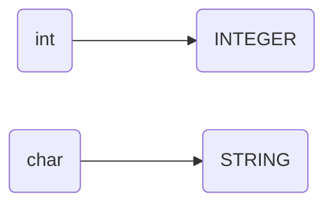

## List of Contents

- [[Structs & Typedef - C#What are `structs`?| What are `structs`?]]
	- [[Structs & Typedef - C#Simple "*Template*" Code| "Template" Code]]
- [[Structs & Typedef - C#Array of Structs | Array of Structs]]
- [[Structs & Typedef - C#`typedef`| Typdef]]

---

### My Links

- [[Structs & Typedef - C#Socials| Links to Socials]]

---

# What are `structs`?

Structures or `structs` ( *for short* ) are; from what I understand it is **similar** to [[Object Oriented Programming - Python | OOP]] ( *but its not actually classes / OOP* ).

>Because as you might know; its that [[C Language | C]] is **only** a *procedural* language and does not provide any support for Classes and Methods.
>>*Not really, its just does **not** have any methods and is very similar to Classes $\rightarrow$ emphasis on SIMILAR*
>
>Hence, what is why we use C++ to be able to get classes and methods!

>[!tip]- Definition from ChatGPT:
>It is a user-defined data type that allows you to group together different variables under a single name. Each variable within the struct is called a member or field. Structs are used to represent a collection of related data elements, similar to a record in other programming languages.

## Simple "*Template*" Code

In the code below $\downarrow$ we can see that we have:

- Created a Class called `Car`
	- Added some attributes to the class `Car`
- Created 2 Objects
	1. `Car_1`
	2. `Car_2`
- Output the values / attributes of each Objects

```C

// Include standard input / output header
#include <stdio.h>
// Include string manipulation header / library
#include <string.h>

// CLASS Car
struct Car 
{

  // Attributes / Properties / Instance Variable of Object
  // DECLARE make: STRING
  char make[25];
  // DECLARE model: STRING
  char model[25];
  // DECLARE hp: INTEGER
  int hp;

};


int main()

{

  // Create Object
  // Object 1 = Car_1
  // Object 2 = Car_2
  // DECLARE Car_1: Car
  struct Car Car_1;
  // DECLARE Car_2: Car
  struct Car Car_2;

  // Add "values" to object Car_1
  strcpy(Car_1.make, "Mazda");
  strcpy(Car_1.model, "RX-7 FD");
  Car_1.hp = 236;

  // Add "values" to object Car_2
  strcpy(Car_2.make, "Toyota");
  strcpy(Car_2.model, "Supra Mark 4");
  Car_2.hp = 280;

  // Output the values of Object Car_1 and Car_2
  printf("\nCar Number 1 Details:\n");
  printf("Make: %s\n", Car_1.make);
  printf("Model: %s\n", Car_1.model);
  printf("Horse Power: %d\n", Car_1.hp);

  printf("----------------------");

  printf("\nCar Number 2 Details:\n");
  printf("Make: %s\n", Car_2.make);
  printf("Model: %s\n", Car_2.model);
  printf("Horse Power: %d\n", Car_2.hp);

  return 0;
}

```

# Array of `structs`

I think you get what we are trying to do, right?

>*We are just trying to make a fucking array you buffoon!*

Let me give you the code first, check it out and then we talk about it.

```C

// Include standard input / output header
#include <stdio.h>
// Include string manipulation header / library
#include <string.h>

// Class Book
struct Book

{

  // Attibutes
  // DECLARE book_name: STRING
  char book_name[30];
  // DECLARE book_author: STRING
  char book_author[30];
  // DECLARE book_rating: INTEGER
  int book_rating;

};

// FUNCTION display_array(DECLARE ARRAY array: Book, DECLARE size: INTEGER)
void display_array(struct Book array[], int size)

{
  // Display Array
  // DECLARE x: INTEGER
  for(int x = 0; x < size; x++){
    // Output Values of array in a Fashionable Way
    printf("\n| %d | Book Name: %s | Book Rating = %d", x, array[x].book_name, array[x].book_rating);
  }
  
}


int main()

{

  // Create Object
  // Object book1
  // Object book2
  // Object book3
  // DECLARE book1: Book
  struct Book book1 = {"Love C Programming", "Suck Ass", 100};
  // DECLARE book2: Book
  struct Book book2 = {"Use Linux like Chads", "Chaddler", 666};
  // DECLARE book3: Book
  struct Book book3 = {"How to CS!", "Richard Dick", 959};

  // Create an Array of `structs`
  // DECLARE ARRAY books: Book
  struct Book books[] = {book1, book2, book3};
  // DECLARE array_size: INTEGER
  int array_size = sizeof(books) / sizeof(books[0]);

  printf("\nBooks\n");
  
  // Call Function `display_array` to output array `books`
  display_array(books, array_size);

  printf("\n\n");

  return 0;
}

```

## Some Explanation ( Array of `structs` )

So, in the code above $\uparrow$; we have created a class called `Book`. Then we made 3 Objects using that class; we have:

- `book1`
- `book2`
- `book3`

each with its own attributes / values.

We then create an **array** of *structs* ( *or classes* ) called `books` and then we made a function called `display_array` to be able to output the values of the array `books`.

I want you to focus on the `display_array` function for a moment.

```C

// Check out the parameters
void display_array(struct Book array[], int size)

{
...
}

```

You see, we do not write `char array[]`; because it is an "*array of struct*". We need to pass an "*array of struct*".

>[!bug] We cannot simply pass `char array[]`

>[!note]-
>In addition, we can access the values using `array[i].something`

# `typedef`

>Yep! That a fucking header if I have ever seen one!
>I mean, that how we spell / write / type `typedef`.

For this one, I think it will better if I show you the code first without any explanation

## Without `structs`

This will include a simple `typedef` without the use of classes / structures.

```C

// Include standard input / output header
#include <stdio.h>

// `typedef` "int" ---> "fucking_ints"
  // Now, if we want to create variables with INTEGER datatypes we can use "fucking_ints"
typedef int fucking_ints;
// `typedef` "int array[5]" ---> "fucking_ints_arrays"
typedef int fucking_ints_arrays[];

// FUNCTION display_array(DECLARE ARRAY array: INTEGER, DECLARE size: INTEGER)
void display_array(fucking_ints array[], fucking_ints size)

{

  // Output array
  // DECLARE i: INTEGER
  for(fucking_ints i = 0; i < size; i++){
    // Output Values in Fashionable Way
    printf("\nIndex: %d | Value = %d", i, array[i]);
  }

  printf("\n");

}

int main()

{

  // DECLARE num: INTEGER
  fucking_ints num = 6;
  // DECLARE ARRAY numbers[6]: INTEGER
  fucking_ints_arrays numbers = {1, 2, 3, 4, 5};
  // DECLARE total_values: INTEGER
  // Acts as array size
    // Here I knew the size of the array
  fucking_ints total_values = 5;

  // Output the values
  printf("\nVariable `num`'s Value = %d\n", num);

  // Calling Function `display_array`
  printf("\nValue of Array `numbers`:\n");
  display_array(numbers, total_values);

  // DECLARE insert_index: INTEGER
  fucking_ints insert_index = 5;
  // DECLARE insert_value: INTEGER
  fucking_ints insert_value = num;

  // Insert variable `num`'s value into the array `numbers`
    // Starting at the top of the array, then moving down
  for(fucking_ints x = total_values; x > insert_index; x--){
    // Move values in array
    numbers[x]= numbers[x - 1];
  }
  
  // Add variable `num` to the end of array
  numbers[insert_index] = insert_value;
  // Increase the size of array by 1
  total_values++;

  // Display Array
  printf("\nAfter Inserting Variable `num`\n");
  display_array(numbers, total_values);

  return 0;
}

```

>Don't worry, I will be giving the explanation below $\rightarrow$ will be a header called `Explanation on typedef`

## With `structs`

```C

// Include standard input / output header
#include <stdio.h>
// Include string manipulation header / library
#include <string.h>

// `typedef` "int" ---> "INTEGER"
typedef int INTEGER;
// `typedef` "char" ---> "STRING"
typedef char STRING[25];

// Class User with `typedef`
typedef struct

{

  // DECLARE user_name: STRING
  STRING user_name;
  // DECLARE profession: STRING
  STRING profession;
  // DECLARE age: INTEGER
  INTEGER age;


}User;

// FUNCTION display_user(CLASS User user)
  // Where 'user' is our object
void display_user(User user)

{

  // Output the values / attributes of user ---> will be passed in main program
  printf("\n");
  printf("User Name: %s\n", user.user_name);
  printf("Profession: %s\n", user.profession);
  printf("Age: %d\n", user.age);

}

int main()

{


  // Create Objects
  // Create Object "user1" and adding its "values" / attributes
  // DECLARE user1: User
  User user1 = {"John Dick", "Kill Silently", 25};
  // Create Object "user2" its "values" / attributes
  // DECLARE user2: User
  User user2 = {"Shavilen Puttay", "Gay Person", 20};
  // Create Object "user3" its "values" / attributes
  // DECLARE user3: User
  User user3 = {"Roy Pilon Paquiom", "Big Shitter", 20};

  // Display users using Function `display_users`
  display_user(user1);
  display_user(user2);
  display_user(user3);

  printf("\n");

  return 0;
}

```

>[!warning] Might have over complicated this a bit!

### Explanation on `typedef`

What I call tell you in the simplest and dumbest way possible; basically you can give **data types** *nicknames*... That's it.

In the example above [[Structs & Typedef - C#Without `structs`| without classes / structs]], we created a *nickname* for the data type `int`.



Now if we move onto the example with [[Structs & Typedef - C#With `structs`| with classes / structs]], we can see that we have made some *nicknames* for `int`, `char` and `struct`



#### `structs`

>Again, what a fucking header name!

For structs its a bit different; refer to the code above $\uparrow$.

Normally, if we want to create and object we would do it like that:

```C

// Include standard input / output header
#include <stdio.h>

// Class User
struct User

{

  // DECLARE user_name: STRING
  STRING user_name;
  // DECLARE profession: STRING
  STRING profession;
  // DECLARE age: INTEGER
  INTEGER age;

};

```

Then in our `main` Function; if we want to create an object we simply do:

```C

struct User user_person1;
struct User user_person2;

```

>[!tip]- But check how we did it above $\uparrow$
>Line `243`, `245`, `247` in [[Structs & Typedef - C#With `structs`| With classes / structs]]
>>Also found another way to **add** "*values*" to objects

---

# Socials

- [**Instagram**](https://www.instagram.com/s.sunhaloo/)
- [**YouTube**](https://www.youtube.com/channel/UCMkQZsuW6eHMhdUObLPSpwg)
- [**GitHub**](https://www.github.com/Sunhaloo)

---

S.Sunhaloo
Thank You!