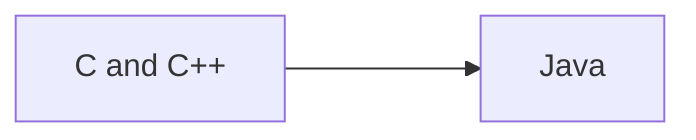

## List of Contents

- [[Java Language#What is Java? | What is Java?]]
- [[Java Language#Creator of Java | Creator of Java]]
- [[Java Language#What can Java do? | What can Java do?]]

---

 - [[Java Language#How to Comment in Java | How to Comment in Java]]

---

### My Links

- [[Java Language#Socials | Link to Socials]]

---

# What is Java?

>[!note]-
>This is just normal, "*raw*" Java
><span style="color: red;">NOT</span> JavaScript, just good all regular Java $\rightarrow$ The software by Oracle with the Coffee Logo.

It is a high-level, class-based, object-oriented programming ( *again Fuck OOP* ) language. It is a general-purpose language that allows programmers to *write once, run everywhere* ( [WORA](https://en.wikipedia.org/wiki/Write_once,_run_anywhere) ).

Because of *WORA*, this means that the code can be both interpreted and compiled ( *kinda, see more about JVM [here](https://en.wikipedia.org/wiki/Java_virtual_machine)* )



It has similar syntax to C and C++; generally speaking, Java is *faster* than [[Python Language | Python]], but slower than [[C Language | C]] and C++ ( *obviously, duh!* ).

## Creator of Java

**Name**: [James Gosling](https://en.wikipedia.org/wiki/James_Gosling)
**Created At**: Sun Microsystems
**Released**: May 1995 as core component of Sun's Java platform

## What can Java do?

As it is a general purpose language; there are many things that Java can do like:

- Web Applications
- Games
- Mobile Applications
- Cloud Applications
- Backend Processing
- Security
- Embedded Systems

---

# How to Comment in Java

To comment a line in Java, we simply use the symbols

>[!tip] Usage
>```java
>// This is a comment!
>```

To get multi-line comments; we use a similar thing that is found in [[C Language#How to comment in C | C]]

>[!tip] Usage
>```java
>/* 
>* This is a 
>* multi-line comment!
>*/
>```

# Simple Java Boiler Plate

As the syntax is more like C. I am going to be including this *boiler plate* as there are somethings that I do not understand... like what is the parameter `String[] args` inside of `main`

```java

// Check the "Warning" below 

// Creates a class
public class Main {

	// This line in the main function
	// Similar to C's `int main(){...}` and VB's `Sub Main() ... End Sub`
	public static void main(String[] args){

		// Outputs "Hello World" with new-line characters at top and bottom
		System.out.println("\nHello World\n");
	
	}

}

```

>[!bug] Warning
>If your file has the file name of `test.java` the first line should also be like `public class test {...}`
>>In short, the **class name** must *match* the **file name**.

# Displaying Things on the Screen

There are many ways to "*print*" something like in Python we simply have `print` and `print(f"...")`. While in here we have `print`, `printf`, `println`... like what!

>I think I will be using the `printf(...)` function as it is the normally used with C.
>In addition, as it is a C function, it will run *fast*!

### Difference between `printf` and `println`

- `println` $\Rightarrow$ "*print line*"
	- Basically, it will place the cursor on the next line $\rightarrow$ creates a new-line character
- `printf` $\Rightarrow$ "*print formatter*"
	- Compared to `println` this one does not create a new line and we actually have to use `\n` to move the cursor to the next line

## Display an Empty Line

In python to display an empty line we simply write `print()`; here we need to use the function. But here, we use either:

```java

System.out.println()

```

Or we use like we do in C

```java

System.out.printf("%n")

```

## Strings

To output / display strings ( *again not the thing that you where* ) data type. We just do as other programming languages

>This text / paragraph above is just for "*show*", don't pay attention to it.

```java

public class Main {

	public static void main(String[] args){

		// `print` function
		// `print` one will not place the cursor on the next line
		System.out.print("Hello World");
		// This means that
		System.out.print("... this text should be right after\n");

		// `println` function
		// use `println` function to create empty line
		System.out.println();
		// `println` one will place the cursor on the next line
		System.out.println("This line is created with `println` function!");
		System.out.println("See how with this is creates this fucking string on another line");

		// `printf` function
		// use `printf` function to create empty line
		System.out.printf("\n");
		// `printf` will not place the cursor on the next line
		System.out.printf("Using `printf` function, we can even pass in variables");
		// Need to use new-line character to create new line
		System.out.printf("\nThis should be on another line");

	}

}

```

## Integers

Even in Java, the `printf` function works just the **same** as C.

```java

public class Main {

	public static void main(String[] args){

		// `print` function
		System.out.println(5);
	
		// use `println` function to create empty line
		System.out.printf("%n");

		// `println` function
		System.out.println(44);

		// The lines below are really similar to C!
		// DECLARE x: INTEGER
		int x = 27;
		// Literally the same format as the `printf` in C
		System.out.printf("%nAyrton Senna's Number: %d", x);

	}

}

```

## Floating Numbers / Decimal Numbers

```java

public class Main {

	public static void main(String[] args){

		// `print` function
		System.out.println(5.00);
	
		// use `println` function to create empty line
		System.out.printf("%n");

		// `println` function
		System.out.println(99.99);

		// The lines below are really similar to C!
		// DECLARE x: INTEGER
		int num = 27;
		// Literally the same format as the `printf` in C
		System.out.printf("%nTotal Inflation is %d %%", num);
	
	}

}

```

>Used `%%` to display '%' symbol

## Boolean

In Java, *true* and *false* are `true` and `false`. Not like in Python where they are `True` and `False`

```java

public class Main {

	public static void main(String[] args){

		// `print` function
		System.out.print(true);

		// create a blank line
		System.out.println();

		// `println` function
		System.out.println(false);

		System.out.println();

		// `printf` function
		// DECLARE java: BOOLEAN
		boolean java = true;
		
		System.out.printf("Java = %b", java);

	}

}

```

>Instead of using `%d` to output boolean values like in C;
>Here we are using `%b` $\Rightarrow$ like it should be!

>[!note]
>There are more data types than this in Java, similar to C; it does have *Byte*, *Long*, *Short* and many more.
>But because we do not really use these; I am not including them ( *famous last words $\rightarrow$ look how I will get this in exams* ).

---

# Socials

- [**Instagram**](https://www.instagram.com/s.sunhaloo/)
- [**YouTube**](https://www.youtube.com/channel/UCMkQZsuW6eHMhdUObLPSpwg)
- [**GitHub**](https://www.github.com/Sunhaloo)

---

S.Sunhaloo
Thank You!