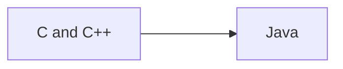

## List of Contents

- [[Java Language#What is Java? | What is Java?]]
- [[Java Language#Creator of Java | Creator of Java]]
- [[Java Language#What can Java do? | What can Java do?]]
- [[Java Language#Versions | Versions]]

---

 - [[Java Language#How to Comment in Java | How to Comment in Java]]
 - [[Java Language#Simple Java Boiler Plate | Simple Java Boiler Plate]]
 - [[Java Language#Displaying Things on the Screen | Displaying "things" on Screen]]
 - [[Java Language#Data Types | Datatypes]]
	 - [[Java Language#Primitive Data Types | Primitive Data Types]]
	 - [[Java Language#Wrapper / Referenced Data Types | Wrapper / Referenced Data Types]]
- [[Java Language#Using Primitive Data Types | Primitive Data Type Usage]]
- [[Java Language#Using Wrapper / Referenced Data Types | Wrapper Data Types Usage]]
- [[Java Language#Multiple Assignment | Multiple Assignment... WTF!?!]]
- [[Java Language#Constants | Constants]]
- [[Java Language#Equivalent of `type()` Function | Equivalent of `type()` Function]]
	- [[Java Language#Primitive Data Types Type Function Usage | Primitive Data Types Type Function Usage]]
	- [[Java Language#Wrapper Objects Type Function Usage | Wrapper Objects Type Function Usage]]
- [[Java Language#Data Types Conversion / Type Cast | Data Types Conversion / Type Cast]]
- [[Java Language#User Inputs | User Inputs]]


---

### My Links

- [[Java Language#Socials | Link to Socials]]

---

# What is Java?

>[!note]-
>This is just normal, "*raw*" Java
><span style="color: red;">NOT</span> JavaScript, just good all regular Java $\rightarrow$ The software by Oracle with the Coffee Logo.

It is a high-level, class-based, object-oriented programming ( *again Fuck OOP* ) language. It is a general-purpose language that allows programmers to *write once, run everywhere* ( [WORA](https://en.wikipedia.org/wiki/Write_once,_run_anywhere) ).

Because of *WORA*, this means that the code can be both interpreted and compiled ( *kinda, see more about JVM [here](https://en.wikipedia.org/wiki/Java_virtual_machine)* )



It has similar syntax to C and C++; generally speaking, Java is *faster* than [[Python Language | Python]], but slower than [[C Language | C]] and C++ ( *obviously, duh!* ).

## Creator of Java

**Name**: [James Gosling](https://en.wikipedia.org/wiki/James_Gosling)
**Created At**: Sun Microsystems
**Released**: May 1995 as core component of Sun's Java platform

## What can Java do?

As it is a general purpose language; there are many things that Java can do like:

- Web Applications
- Games
- Mobile Applications
- Cloud Applications
- Backend Processing
- Security
- Embedded Systems

---

# Versions

Now, if you are creating a project in any IDE ( *VS Code, NetBeans* ), whatever the IDE maybe, you might be wandering why are there many versions of Java

For Example:

- If you are using Java Coding Pack with VS Code, you will have to choose between many *versions* during the creation of a project
	- No build tools
	- Maven
	- Gradle
	- Spring Boot
	- JavaFX

Every "*version*" includes different dependencies to help create and manage a Java Project.

>[!info]
>This is just normal Java like "*raw*" Java for the moment;
>>When or if I am going to be using Maven or JavaFX or other stuff; I am going to be creating a separate folder for that. Just like I did with Python Modules!

---

>[!tip] Some Tips
>Java's syntax is kind of similar to C's syntax, so I you already know C, then good for you my brother!
>In addition, we **do** need to declare our variables and constant... I think all programming languages that I know of have declaration except [[Python Language | Python]].

# How to Comment in Java

To comment a line in Java, we simply use the symbols

>[!tip] Usage
>```java
>// This is a comment!
>```

To get multi-line comments; we use a similar thing that is found in [[C Language#How to comment in C | C]]

>[!tip] Usage
>```java
>/* 
>* This is a 
>* multi-line comment!
>*/
>```

Now, there is a special type of comment called a "**Javadoc**" comment; its basically used to write *documentation* comments in the code / program.

>[!tip] Usage
>```java
>/**
>* This is a 
>* javadoc comment!
>*/
>```
>>[!note]
>>The javadoc comments may also include / contain

# Simple Java Boiler Plate

As the syntax is more like C. I am going to be including this *boiler plate* as there are somethings that I do not understand... like what is the parameter `String[] args` inside of `main`

```java

// Check the "Warning" below 

// Creates a class
public class Main {

	// This line in the main function
	// Similar to C's `int main(){...}` and VB's `Sub Main() ... End Sub`
	public static void main(String[] args){

		// Outputs "Hello World" with new-line characters at top and bottom
		System.out.println("\nHello World\n");
	
	}

}

```

>[!bug] Warning
>If your file has the file name of `test.java` the first line should also be like `public class test {...}`
>>In short, the **class name** must *match* the **file name**.

# Displaying Things on the Screen

There are many ways to "*print*" something like in Python we simply have `print` and `print(f"...")`. While in here we have `print`, `printf`, `println`... like what!

>I think I will be using the `printf(...)` function as it is the normally used with C.
>In addition, as it is a C function, it will run *fast*!

### Difference between `printf` and `println`

- `println` $\Rightarrow$ "*print line*"
	- Basically, it will place the cursor on the next line $\rightarrow$ creates a new-line character
- `printf` $\Rightarrow$ "*print formatter*"
	- Compared to `println` this one does not create a new line and we actually have to use `\n` to move the cursor to the next line

## Display an Empty Line

In python to display an empty line we simply write `print()`; here we need to use the function. But here, we use either:

```java

System.out.println()

```

Or we use like we do in C

```java

System.out.printf("%n")

```

# Data Types

## Primitive v/s Wrapper / Referenced

### Primitive Data Types

These are really simple and easy to use data types. Its actually the similar ( *or the same* ) as the datatypes found in [[C Language#What Data Types are Available? | C]].

In addition, they are more memory-efficient as they are **not** *Objects*.

>With this one; you cannot like convert it into other data types, use special built-in functions / methods, etc.

#### Example of Primitive Data Types

| Data Type | Size ( Bits ) | Default Value |
| --------- | ------------- | ------------- |
| `boolean` | 1 | false |
| `byte` | 8 | 0 |
| `short` | 16 | 0 |
| `int` | 32 | 0 |
| `long` | 64 | 0L |
| `float` | 32 | 0.0f |
| `double` | 64 | 0.0d |
| `char` | 16 | '\u0000' |

These datatypes are **signed** datatypes; which means that they can be positive and negative.

#### Calculate the Range

##### Unsigned Data Types ( *only positive* )

Lets calculate the range of an **unsigned** byte.

We know that a byte is $8$ bits; hence, we have $2^{8} = 256$.

Now we take the the $256$ and the we need to remove 1 from it, so it the **final** answer is 255. Thus the range is:

$$0 \rightarrow 255$$

>[!note] Why is it **not** $0 \rightarrow 256$?
>This is because we are also counting the value '0'. If you include the value of '0'; we are going to have all 256 numbers
>>We are **not** calculating the size; we are calculating the *range*.

#### Signed Data Types ( *negative $\longleftrightarrow$ positive* )

Now the initial process is the same as above $\uparrow$. But as we now have 2 sides ( *positive and negative* ). Its going to be a little different.

Lets try calculating the **range** of **signed** integer.

Integer = $32$ bits $\Rightarrow 2^{32} = 4.2949673\times10^{9}$

Now, we are going to be dividing that number by 2 so we get: $$\frac{2^{32}}{2}$$

In addition, we have 2 sides and we know that we **need** to include the number '*0*'

- Positive End
	- Just take the resulting number and **minus** 1 $\Rightarrow \frac{2^{32}}{2} - 1$
- Negative End
	- Just **reverse** the sign of the value of $\frac{2^{32}}{2}$

Hence, the **range** will become:

$-\frac{2^{32}}{2} $\longleftrightarrow \frac{2^{32}}{2} -1$

>[!tip]-
>We can use the **same** principle to calculate all the ranges, nevertheless we still need to know the size in *bits*!

### Wrapper / Referenced Data Types

Basically its *primitive* data **encapsulated** in an *Object*. Compared to *primitive* datatypes; we can definitely use functions like `.getClass`, `Integer.parseInt()`, `String.valueOf()` and much much more.

| Data Type | Size ( Bits ) | Default Value |
| --------- | ------------- | ------------- |
| `Boolean` | 1 | false |
| `Byte` | 8 | 0 |
| `Short` | 16 | 0 |
| `Int` | 32 | 0 |
| `Long` | 64 | 0L |
| `Float` | 32 | 0.0f |
| `Double` | 64 | 0.0d |
| `Character` | 16 | '\u0000' |
| `String` | 32 or 64 |  |

>See that here it starts with **capital** letter / character.

# Using Primitive Data Types

>[!note]
>Again, its not like we can use fancy built-in functions with this "*type*" of datatype.
>Hence, if you want to convert, get the class of a variable; just simple use Wrappers / Referenced.

>[!info]-
>As this part is similar / "*same*" as [[C Language#Data Types, Constants and Variables | C]]; I am going to be quick.

```java

public class Main {

    public static void main(String[] args) {

        // Primitive Data Types

        // Char
        char character = 'A';

        // Byte, Short, Integer, Long
        byte byte_num = 127; // Its max value = 127; if you put '128', use 'int'
        short short_num = 128;
        int int_num = 100000;
        long long_num = 99999999L;

        // Decimal Numbers
        float float_num = 44.27f;
        double double_num = 6969.69;

        // Boolean
        boolean bool_value = false;

        System.out.println();
        System.out.println("Primitive Data Types");
        System.out.println();

        System.out.printf("character = %c\n", character);
        System.out.printf("byte Number = %d\n", byte_num);
        System.out.printf("short Number = %d\n", short_num);
        System.out.printf("integer Number = %d\n", int_num);
        System.out.printf("long Number = %d\n", long_num);
        System.out.printf("float Number = %.3f\n", float_num);
        System.out.printf("double Number = %.2f\n", double_num);
        System.out.printf("boolean Value = %b\n", bool_value);

        System.out.println();

    }

}

```

>[!warning]
>The format specifiers are <span style="color: red;">NOT</span> the **same**.

# Using Wrapper / Referenced Data Types

>[!tip]-
>Here we can definitely use *FaNcY* built-in functions!

>Just a little head-up; I am going to be solely using `println()` function here.

```java

public class Main {

    public static void main(String[] args) {

        // Wrapper Data Types

        // Char
        Character character = 'A';
        // String
        String string_character = "Carlos Sainz";

        // Byte, Short, Integer, Long
        Byte byte_num = 127; // Its max value = 127; if you put '128', use 'int'
        Short short_num = 128;
        Integer int_num = 100000;
        Long long_num = 99999999L;

        // Decimal Numbers
        Float float_num = 44.27f;
        Double double_num = 6969.69;

        // Boolean
        Boolean bool_value = false;

        System.out.println();
        System.out.println("Wrapper Data Types");
        System.out.println();

        System.out.println("Character = " + character);
        System.out.println("String = " + string_character);
        System.out.println("Byte Number = " + byte_num);
        System.out.println("Short Number = " + short_num);
        System.out.println("Integer Number = " + int_num);
        System.out.println("Long Number = " + long_num);
        System.out.println("Float Number = " + float_num);
        System.out.println("Double Number = " + double_num);
        System.out.println("Boolean Value = " + bool_value);
        System.out.println();

    }

}

```

# Multiple Assignment

Now, what did you think... You definitely know that you need to declare your stuff in Java and also in [[C Language]]; then why are you here?

>Again, we do not need to declare in Python, hence we can stuff like this over [[Python Language#Multiple Assignments | there]]

## But we can definitely do this

```java

public class Main {

    public static void main(String[] args) {

        // NO Multiple Assignment

        // DECLARE int_number: INTEGER
        int int_number;
        // DECLARE number_five: INTEGER
        int number_five;

        // Initialisation
        int_number = number_five = 5;


        System.out.println();

        // Output
        System.out.println("Value of `int_number` = " + int_number + "\nValue of `number_five` = " + number_five);

        System.out.println();

    }

}

```

>[!note]-
>Here I have done it with `int`; but you can do this with any data types; works with *Primitive* and *Referenced*.
>You can even do this $\downarrow$:
>```java
>// DECLARE int_number: INTEGER
>Integer int_number;
>// DECLARE number_five: INTEGER
>int number_five;
>
>// Initialisation
>int_number = number_five = 5;
>
>```

# Constants

In C where we can use something like this:

```C

const double PI = 3.142;

```

Now in Java, we have something called `final` and also `static` to create constants.

## When to use `final` or `static` or both

### `final` Keyword

We use `final` to indicate the the constant **cannot** be changed once it is *initialised*.
It is an **instance** variable; meaning each instance of the class has its own copy of the variable.

### `static` Keyword

This one will be a **class** constant therefore there is only 1 copy of this variable shared among all instances of the class.
Must be initialised **explicitly**, as it is not final

### `final static` Keywords

The constant will be a **class** level variable. It **cannot** be changed once its initialised and there is only one copy shared among all instances of class.

>I still do not really quite understand this.

# Equivalent of `type()` Function

## Primitive Data Types Type Function Usage

>[!info]-
>This part '*Primitive Data Types Type Function*' was written on 06/06/2024
>I just found out how you can use the `.getClass()` and `.getSimpleName()` function with **Primitive** Data Types!
>I found this while doing the [[Java Math Library]] note.

>[!warning]
>You <span style="color: red;">cannot</span> find the "*type*" of a Primitive Data Type
>You first need to convert it to an <span style="color: green;">Object</span> / Wrapper Object to be able to use the `.getClass()` and `.getSimpleName()` function.

>I am just going to be adding the code; not doing anything fancy in terms of explanation

```java

public class Main {
    public static void main(String[] args) {

        // Primitive Data Types
        // equivalent of `type()` function in Python

        // DECLARE s_num: INTEGER
        short s_num = 1;
        // DECLARE i_num: INTEGER
        int i_num = 16;
        // DECLARE l_num: INTEGER
        long l_num = 99;
        // DECLARE f_num: FLOAT
        float f_num = 3.142f;
        // DELCLARE d_num: DOUBLE
        double PI = Math.PI;
        // DELCLARE character: CHAR
        char character = 'S';
        // DELCLARE bool: BOOLEAN
        boolean bool = false;

        // finding the datatype of Primitive DataTypes
        
        System.out.println("\nPrimitive Data Types `type()` Function Equivalent\n");
        
        // converting Primitive Datatypes ---> Objects / Wrapper / Referenced Datatypes
        System.out.println(((Object)s_num).getClass().getSimpleName());
        System.out.println(((Object)i_num).getClass().getSimpleName());
        System.out.println(((Object)l_num).getClass().getSimpleName());
        System.out.println(((Object)f_num).getClass().getSimpleName());
        System.out.println(((Object)PI).getClass().getSimpleName());
        System.out.println(((Object)character).getClass().getSimpleName());
        System.out.println(((Object)bool).getClass().getSimpleName() + "\n");

    }
}

```

>[!warning]
>Because the `.getClass()` and `.getSimpleName()` are **class method**; you can **only** use the `System.out.println()` function when using these $\uparrow$ *methods*

## Wrapper Objects Type Function Usage

If Python, you know that we have the [[Python Language#Type Function | `type()`]] function.

This function allows one to **get** the *datatype* of a variable.

>Again, Python does **not** have declaration.
>I think you get it, I am not going to say that again.

Hence, I wanted to see if there is an equivalent in Python and what do you know there is!

>[!warning]
>This only work with the **[[Java Language#Wrapper / Referenced Data Types | Wrapper]]** *objects* data type.

## `.getClass()` Function

>[!tip] Usage
>```java
>x.getClass()
>```

```java

public class Main {

    public static void main(String[] args) {

        // `.getClass` Function ---> Only on Wrapper Objects

        // DECLARE num_byte: BYTE
        Byte num_byte = -128;
        // DECLARE num_int: INTEGER
        Integer num_int = 55;
        // DECLARE alphabets: STRING
        String alphabets = "ABCDefgh"; 
        // DECLARE percentage: DOUBLE
        Double percentage = 98.905;

        // Check class / data type
        System.out.println("`num_byte` class = " + num_byte.getClass());
        System.out.println("`num_int` class = " + num_int.getClass());
        System.out.println("`alpabets` class = " + alphabets.getClass());
        System.out.println("`percentage` class = " + percentage.getClass());

    }

}

```

Using this function we get an output of something like this ( *from the program code above $\uparrow$* ):

```console

`num_byte` class = class java.lang.Byte
`num_int` class = class java.lang.Integer
`alpabets` class = class java.lang.String
`percentage` class = class java.lang.Double

```

### Combining with `.getSimpleName()`

Now if you take the same code above and just do this in your `System.out.println()` function

```java

System.out.println("`num_byte` class = " + num_byte.getClass().getSimpleName());
System.out.println("`num_int` class = " + num_int.getClass().getSimpleName());
System.out.println("`alpabets` class = " + alphabets.getClass().getSimpleName());
System.out.println("`percentage` class = " + percentage.getClass().getSimpleName());

```

Then the output will be much more *simpler* ( *what did you expect to be much more difficult* ).

```console

`num_byte` class = Byte
`num_int` class = Integer
`alpabets` class = String
`percentage` class = Double

```

# Data Types Conversion / Type Cast

## Converting Primitive Data Types

As you know Primitive Data Types are... "*[[Java Language#Primitive Data Types | primitive]]*". This are datatypes from [[C Language | C]] which are basically `int`, `float`, `double`, etc. But we did **not** have `String`

>[!note]
>Because `String` is an "*Object*" ( *because Java is Object Oriented* )
>So for some datatypes; like converting `"12345"` to `int`; we will need to use `Integer.parseInt()` methods $\Rightarrow$ again because *OOP* / `String`.

>I will be including most conversion in the code below $\downarrow$ instead of writing like different sub-headings

```java

public class Main {
    public static void main(String[] args) {

        // Datatypes Conversion

        System.out.println("\nPrimitive Datatype Type Cast");

        // converting data types that contains numbers
            // like `short`, `short`, `int`, `long`, `float`, `double`
        
        // DECLARE s_num: INTEGER
        short s_num = 2;
        // output the datatype of variable `s_num`
            // convert Primitive datatype into Object / Wrapper / Referenced
        System.out.println("\nVariable `s_num` = " + ((Object)s_num).getClass().getSimpleName() + " ( Datatype )");

        // DECLARE i_num: INTEGER
            // converting `s_num` ---> `i_num`
        int i_num = (int) s_num;
        // output the datatype of variable `i_num`
            // convert Primitive datatype into Object / Wrapper / Referenced
        System.out.println("Variable `i_num` = " + ((Object)i_num).getClass().getSimpleName() + " ( Datatype )");

        // DECLARE l_num: INTEGER
            // converting `i_num` ---> `l_num`
        long l_num = (long) i_num;
        // output the datatype of variable `l_num`
            // convert Primitive datatype into Object / Wrapper / Referenced
        System.out.println("Variable `l_num` = " + ((Object)l_num).getClass().getSimpleName() + " ( Datatype )");

        // DECLARE f_num: FLOAT
            // converting `l_num` ---> `f_num`
        float f_num = (float) l_num;
        // output the datatype of variable `f_num`
            // convert Primitive datatype into Object / Wrapper / Referenced
        System.out.println("Variable `f_num` = " + ((Object)f_num).getClass().getSimpleName() + " ( Datatype )");

        // DECLARE d_num: DOUBLE
            // converting `f_num` ---> `d_num`
        double d_num = (double) f_num;
        // output the datatype of variable `d_num`
            // convert Primitive datatype into Object / Wrapper / Referenced
        System.out.println("Variable `d_num` = " + ((Object)d_num).getClass().getSimpleName() + " ( Datatype )\n");

    }
    
}

```

## Converting Wrapper / Object Datatypes

>[!bug]- You **cannot** do that!
>For what I know now; if I manage to do it; then I will be updating this part of the note.

### You Cannot Do That

>Just going to be adding some Code Snippets

```java

        // DECLARE s_num: INTEGER
        Short s_num = 2;

        // DECLARE i_num: INTEGER
	        // you CANNOT do like Integer ---> Integer
        Integer i_num = (Integer) s_num;

        // DECLARE l_num: INTEGER
        Long l_num = (Long) i_num;

```

## Converting Wrapper / Object Datatypes to Primitive Datatypes

>Continuing from [[Java Language#You Cannot Do That | above]] $\uparrow$

But you **can** absolutely do this:

<p align="center"><code>Object / Wrapper Datatypes</code> ---> <code>Primitive Datatypes</code></p>

>[!bug]- But You **Cannot** Do This!
><p align="center"><code>Primitive Datatypes</code> ---> <code>Object / Wrapper Datatypes</code></p>
>>This is **not** allowed!!!

```java

public class Main {
    public static void main(String[] args) {

        // Datatypes Conversion

        System.out.println("\nObject / Wrapper / Referenced Datatype Type Cast");

        // converting data types that contains numbers
            // like `short`, `short`, `int`, `long`, `float`, `double`
        
        // DECLARE s_num: INTEGER
        Short s_num = 2;
        // output the datatype of variable `s_num`
            // in this case we do NOT need to convert to Object!
        System.out.println("\nVariable `s_num` = " + s_num.getClass().getSimpleName() + " ( Datatype )");

        // DECLARE i_num: INTEGER
            // converting `s_num` ---> `i_num`
        Integer i_num = (int) s_num;
        // output the datatype of variable `i_num`
        System.out.println("Variable `i_num` = " + i_num.getClass().getSimpleName() + " ( Datatype )");

        // DECLARE l_num: INTEGER
            // converting `i_num` ---> `l_num`
        Long l_num = (long) i_num;
        // output the datatype of variable `l_num`
        System.out.println("Variable `l_num` = " + l_num.getClass().getSimpleName() + " ( Datatype )");

        // DECLARE f_num: FLOAT
            // converting `l_num` ---> `f_num`
        Float f_num = (float) l_num;
        // output the datatype of variable `f_num`
        System.out.println("Variable `f_num` = " + f_num.getClass().getSimpleName() + " ( Datatype )");

        // DECLARE d_num: DOUBLE
            // converting `f_num` ---> `d_num`
        Double d_num = (double) f_num;
        // output the datatype of variable `d_num`
        System.out.println("Variable `d_num` = " + d_num.getClass().getSimpleName() + " ( Datatype )\n");

    }
    
}

```

>[!info]
>From what I can understand; You can make a Object / Wrapper datatype **hold** a *Primitive* datatype!!!
>>But not the other way around.

# User Inputs

Now, this is going to be like [[C Language#Boolean | booleans]] in C; why? because to use the function that we are going to be using in Java to take user inputs. We need to **import** it first.

Hence, we need to import this module below $\downarrow$:

```java

import java.util.Scanner;

```

>[!warning]
>Java's User Inputs are similar to Visual Basic's User Input.
>What I mean is that remember we used to do something like this below $\downarrow$ in VB:
>```vb
>Console.WriteLine("Enter Your Name: ")
>Dim name As String = Console.ReadLine()
>```

### Using `.next()` Function

This is similar to the [[C Language#User Inputs | `scanf`]] function in C. Remember how we could **not** input things like `Hello World`; if you only "*register*" `Hello` and completely ignore the `World` part.

>This is because of `<Space>` character.
>Meaning, that it will take any set of characters until it meet the `<Space>` character.

You could say that is the same with `.next()` function.

```java

import java.util.Scanner;

public class Main {
    
    public static void main(String[] args) {

        // create Scanner with identifier name scanner1
        Scanner scanner1 = new Scanner(System.in);

        // Ask the user to enter his name
        System.out.printf("\nPlease Enter A Single Word: ");
        String word = scanner1.next();

        // output the user's word appropriately
        System.out.println("Your Word is " + word);

        // closing the Scanner to prevent memory leak
        scanner1.close();

    }
    
}

```

>[!tip]
>Use the `printf()` or `print()` function while asking the user to input something
>Then it will be the same as using the `input()` function in [[Python Language#User Inputs | Python]].
>>Also remember to **close** the Scanner to avoid *Resource Leaks*

>[!note] What is the `(System.in)`?
>This is basically the Console / Terminal where we enter our data.
>Think of the "*System*" asking for an input.

### Using `.nextLine()`

This is like the [[C Language#`fgets()` Function | `fgets()`]] function in C; where I will also "*register*" characters after the `<Space>`.

```java

import java.util.Scanner;

public class Main {
    
    public static void main(String[] args) {

        // create Scanner with identifier name scanner1
        Scanner scanner1 = new Scanner(System.in);

        // Ask the user to enter his name
        System.out.printf("\nPlease Enter Your Name: ");
        String name = scanner1.nextLine();

        // output the user's name appropriately
        System.out.println("\nYour Name is " + name);

        // closing the Scanner to prevent memory leak
        scanner1.close();

    }
    
}

```

>[!warning] First Warning
>I have just been using the `String` data type.
>If you want *read* other data types like Integers and Float and all of the sweet coconut oil good stuff ( *saying by ThePrimeagan* ).
>Then you will need to use functions like:
>`nextInt()`
>`nextFloat()`

>[!warning] Second Warning
>Similar to C's [[C Tips#Get Rid of ` n` ( Newline Character ) | User Input]]; if you **prompt** the user to enter an *Integer* value, then you immediately prompt him ( *or her* ) to enter a *String* "*value*". Then the value will be **<span style="color: red;">lost</span>** because of the new line character "*thingy*".
>
>Hence, we need to just input add this $\downarrow$ after asking the user to enter *Integer* value ( *but before asking to enter String value* )
>```java
>// import our Scanner Object
>import java.util.Scanner;
>// our Scanner with identifier `input`
>Scanner input = new Scanner(System.in);
>// place this after asking Integer input but BEFORE asking String input
>input.nextLine();
>```
>Therefore, you will have no problem... Thank me Later!

---

# Socials

- [**Instagram**](https://www.instagram.com/s.sunhaloo/)
- [**YouTube**](https://www.youtube.com/channel/UCMkQZsuW6eHMhdUObLPSpwg)
- [**GitHub**](https://www.github.com/Sunhaloo)

---

S.Sunhaloo
Thank You!