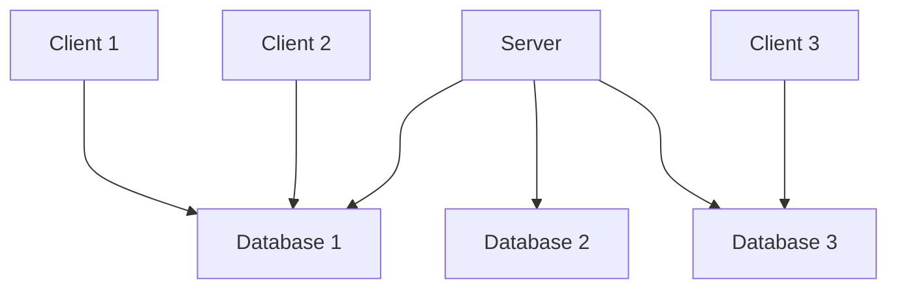

## List of Contents

### General Points

- [[Microsoft SQL Server 2022#Requirements | Requirements]]
- [[Microsoft SQL Server 2022#Server v/s Database | Server v/s Database]]

### SQL Server Management Studio Usage

- [[Microsoft SQL Server 2022#Getting Started | Getting Started]]
	- [[Microsoft SQL Server 2022#Opening Management Studio | Opening Management Studio]]
	- [[Microsoft SQL Server 2022#The Object Explorer | The Object Explorer]]
	- [[Microsoft SQL Server 2022#New Query | New Query]]
	- [[Microsoft SQL Server 2022#Final Setup | Final Setup]]
	- [[Microsoft SQL Server 2022#Disconnecting from Server | Disconnecting from Server]]

### Structured Query Language - SQL

- [[Microsoft SQL Server 2022#SQL Commands | SQL Commands]]
	- [[Microsoft SQL Server 2022#Data Definition Language ( DDL ) | Data Definition Language ( DDL )]]
		- [[Microsoft SQL Server 2022#Create Database | Create Database]]
			- [[Microsoft SQL Server 2022#Verification - Creation of Database `Test` | Verify Creation of Database]]
		- [[Microsoft SQL Server 2022#Create Tables | CREATE TABLES]]
			- [[Microsoft SQL Server 2022#Create a Simple Table | Create a Simple Table]]
			- [[Microsoft SQL Server 2022#Create a Normal Table | Create a Normal Table]]
	- [[Microsoft SQL Server 2022#Constraints, Defaults and More | Constraints, Defaults and More]]
		- [[Microsoft SQL Server 2022#The Unique Constraint | UNIQUE Constraint]]
		- [[Microsoft SQL Server 2022#The Not Null Constraint | NOT NULL Constraint]]
		- [[Microsoft SQL Server 2022#The Primary Key Constraint | PRIMARY KEY Constraint]]
			- [[Microsoft SQL Server 2022#Composite Primary Key | Composite Primary Key]]
		- [[Microsoft SQL Server 2022#Foreign Key Constraint | FOREIGN KEY Constraint]]
		- [[Microsoft SQL Server 2022#Default Constraint | DEFAULT Constraint]]
		- [[Microsoft SQL Server 2022#Check Constraint | CHECK Constraint]]
			- [[Microsoft SQL Server 2022#Check Constraint - Range | Range of Values]]
			- [[Microsoft SQL Server 2022#Check Constraint - List of Values | List of Values]]
			- [[Microsoft SQL Server 2022#Check Constraint - Value Prefix | Value Prefix]]
	- [[Microsoft SQL Server 2022#Data Manipulation Language ( DML ) | Date Manipulation Language ( DML )]]
		- [[Microsoft SQL Server 2022#The Select Command | SELECT Command]]
		- [[Microsoft SQL Server 2022#The Insert Into Command | INSERT INTO]]

---

### My Links

- [[Microsoft SQL Server 2022#Socials | Link to Socials]]

---

# Requirements

## SQL Server 2022 Express Edition Installation

This is the actual "*server*" that will allow us to connect to **local** or **remote** servers.

The download link is: https://www.microsoft.com/en-us/sql-server/sql-server-downloads


## SQL Server Management Studio Installation

Think of this program like an editor and management for the "*server*".
It's the place where the user will be able to; for example run commands and queries ( *and more*! ), which will be *re-directed* to the SQL Server $\uparrow$

Here is the download link for Management Studio: https://learn.microsoft.com/en-us/sql/ssms/download-sql-server-management-studio-ssms?view=sql-server-ver16

>[!warning] Short Notice for my Linux Fans
>The SQL Server is available on Linux that to only on Ubuntu
>But the Management Studio is <span style="color: red;">not</span> available.
>Hence, if you want to use a GUI application / program for running command and more; you can use [Visual Studio Code]() with the proper extensions.
>>I tried installing on Pop OS ( *which is based on Ubuntu which is based on Debian* ); but it crashed my **update** and I could not update... Hence, I switched to Endeavour OS...
>>I use Arch BTW!

---

>Start of the actual notes / documentation

# Server v/s Database

Study this image below $\downarrow$

![[Server and Database | 800]]

Let's break this image down!

>This is going to be so much easier if you already understand the '*Client-Server Model*'.

So you have a **Client**. This *client* is the **user**; the user can access the **Server** from the *desktop*, `ssh`, etc.

Now when the user is going to access this so called "*server*". He is not accessing the **Databases** ( *or Tables if you prefer* ) directly.

In this *server*, you will find that we have many **databases** and hence, the client connects to that server and then selects what databases he wants to work with.

>Like in the image! $\uparrow$



>I hope this mermaid graph helps you to visualise it better!

# Getting Started

>[!warning]
>As I said I am currently running Endeavour OS and as it is Arch based distribution... No, I can install it on Arch using the AUR / `yay` as you can see $\downarrow$:
>```console
>aur/go-sqlcmd 1.7.0-1 (+1 0.00) 
>    CLI for SQL Server and Azure SQL
>```
>But for simplicity sake and as I am do not want to brick my update and other shitty stuff happening to my system. I am going to simply use SQL Server 2022 and SQL Server Management Studio on Windows.
>>Also they are using Windows to show SQL Server in University. Sooooo...

## Opening Management Studio

Every time that you start up the program; you will be greeted with this $\downarrow$

![[SQL Server 2022 - Connect to Server Screen.png]]

This is the place where you are going to **connect** to the server that you want

>[!note]
>For the moment, we are only going to be using the `localhost` to learn the commands of [[Database Languages#Structured Query Language ( SQL ) | SQL]]
>Hence, if we are going to continue using the `localhost` "*server*"; we need to make a few adjustments!

As you can see from the picture above $\uparrow$. In the **Login** tab; leave **every** option alone.
But for the *Encryption* set it to `Optional` ( *again as shown in the image $\uparrow$* )

After you are done then you can press the <button>Connect</button> button.

>[!info]
>Why did we leave options like *Server type*, *Server name* and the other options *alone*?
>This is because we **want** to connect to `localhost`; the server name that was provided is your <u>machine's name</u>.
>>If you check out the '*User name*' option ( *which we cannot tamper with* ); you can see that my username is `azmaan`!

## The Object Explorer

When you have successfully connected to `localhost`, you should see the "*Object Explorer*" in the left part of the screen.

>It should look something like this $\downarrow$

![[SQL Server 2022 - Object Explorer.png]]

>I have cut out the screenshot because its to big
>"*That's what she said*"

This is where you are going to see your databases, tables and more!

Here is another image to show you what it looks like after **expanding** some *folders* and *databases* $\downarrow$

![[SQL Server 2022 - Object Explorer ( Expanded ).png]]

>[!warning]
>If you accidentally close the Object Explorer, no worries mate!
>You can quickly bring it up by pressing the `<F8>` key.

## New Query

So there is a button called <button>New Query</button>. Now this button the button that will bring up the Editor ( *if you can called it that* )

![[SQL Server 2022 - New Query Button.png]]

>[!note]
>The shortcut for a *New Query* is `<Ctrl> + N`

## Final Setup

As I said it should bring up the "*Editor*" ( *I called it the Editor... Fuck Off* )

Your setup should now look something like this $\downarrow$:

![[SQL Server 2022 - Final Setup.png | 785]]

>[!note]
>When I did this on my laptop; the Object Explorer was on the side.
>I don't know why here on my Desktop its not the case.
>But then again you can open in up using the `<F8>` key.

## Disconnecting from Server

![[SQL Server 2022 - Object Explorer ( Disconnect from Server ).png]]

>Or you can also click on '**File**' and then select '**Disconnect Object Explorer**'

---

# SQL Commands

## Data Definition Language ( DDL )

>This '[[Database Languages#Data Definition Language ( DDL ) | Data Definition Language]]' is a note that I made; you can read a little bit more about DDL... "*if you want to*".

### Writing Comments in SQL

To write comments in SQL; simply use 2 hyphen characters ( `--` )

#### Single Line Comments

```SQL
-- this is a comment
-- this is the same as the Lua Programming Language
```

#### Multi-Line Comments

```SQL
/*
This is a multi-line comment
It's similar to C and Java's multi-line comment.
*/
```

### Create Database

If you have seen the image of [[Microsoft SQL Server 2022#Server v/s Database | Server v/s Database]] above $\uparrow$. Then you will immediately know where we are going with this!

We are not going to create a new **Database** with the identifier name `Test`.

>"*But what is the command?*" you ask... Patient Son, Patient!
>Because we need to learn it first then I can show you the actual command.

```SQL
CREATE DATABASE db_name;
```

Hence, in our case, we need to modify the above $\uparrow$ *template* command to this $\downarrow$:

```SQL
CREATE DATABASE Test;
```

>[!info]
>When you are going to create that database; you will not see anything appear on the [[Microsoft SQL Server 2022#The Object Explorer | Object Explorer]].
>This is because ( *from what I can see* ) it's not in real-time.
>Hence, we need to press the <button>Refresh</button> icon found near our [[Microsoft SQL Server 2022#Disconnecting from Server | disconnect button]].

>[!warning]
>If you use [[Git Setup | Git]] or [GitHub](https://www.github.com), then you know that we can have many [[Git Branches | branches]] like `main` or `master` and the other user created ones.
>We do **not** really have this here but we have it in terms of **Database**
>When you are going to create that database `Test`; when you are going to type it in the *Editor*. You will be typing it in the `master` **database**
>>Check this out $\downarrow$
>>![[SQL Server 2022 - 'master' Database.png]]
>This is **fine**! We did not create any problems ( *for now* )
>
>---
>
>Follow well now!!!
>**After** creating our database `Test`. <span style="color: orange;">We need to switched to our <code>Test</code> Database!!!</span>.
>You can either:
>- Select the Database `Test` in the Object Explorer and make sure it becomes `Test` ( *check the image $\uparrow$* )
>- You can also use the drop-down menu and then select the `Test` database.
>
>>If you do <span style="color: red;"><strong>not</strong></span> do this step; all of our tables, indices and more will be created in our `master` Database.
>>And that's not good mate!

#### Verification - Creation of Database `Test`

We can verify if our database has been created correctly by running the following command $\downarrow$:

```SQL
SELECT * FROM sys.datbases WHERE name = "db_name";
```

Hence, we are going to run:

```SQL
SELECT * FROM sys.datbases WHERE name = "Test";
```

But I am not going to run that command with the `WHERE` clause, I am only going to run `SELECT * FROM sys.databases;`

Thus, our output file will be:

```csv
master
tempdb
model
msdb
Dreamhome
Test <--- Here is our Database `Test`!
```

>[!success]-
>Hence, we can say that we have successfully created our Database `Test`!

>[!note]
>The output does not contain the "*Header*"; if we take the example from above $\uparrow$, the header would have been *name*.
>I will find a way to get the output with *Headers*.
>>For the moment, please bear with me.

### Create Tables

Now, we have created our Database `Test`. We can now create our Database Objects like *tables*, *indices* and more!

>[!warning]
>Don't Forget to switch to the `Test` Database
>>Else everything will be fucked up!

#### Create a Simple Table

Let's go ahead and create the table `Student`; this table will only contain 2 columns / fields / attribute.

Table: Student

| First_Name | Last_Name |
| ---------- | --------- |

>If you did Computer Science in HSC... this will be a piece of cake for you!

```SQL
create table Student (
	First_Name VARCHAR(20),
	Last_Name VARCHAR(20),
);
```

##### Verification - Creation of Table `Student`

To check if we created our table `Student`; then we can run the command below $\downarrow$:

```SQL
SELECT name, type_desc, create_date FROM sys.tables;
```

In this case, our `.csv` output file will contain the fields *name*, *type_desc* and *create_date*

```csv
Student,USER_TABLE,2024-08-05 04:15:48.537
```

#### Create a Normal Table

Let's now go ahead an create a *Staff* table.

Table: Staff

| StaffID | Staff_Name | NIC | DOB | Faculty | Address | Phone_Number |
| ------- | ---------- | --- | --- | ------- | ------- | ------------ |

Here is the command $\downarrow$:

```SQL
CREATE TABLE Staff (
	StaffID INTEGER PRIMARY KEY DEFAULT 0000,
	Staff_Name VARCHAR(20),
	NIC VARCHAR(14) NOT NULL CHECK ( NIC LIKE 'S%'),
	DOB DATE,
	Address VARCHAR(50),
	Phone_Number INTEGER CHECK ( Phone_Number LIKE '5%')
);
```

##### Verification - Creation of Table `Staff`

```SQL
SELECT name, type_desc, create_date FROM sys.tables;
```

We are going to now see 2 tables; table *Student* and also our newly created *Staff* table.

```csv
Student,USER_TABLE,2024-08-05 04:15:48.537
Staff,USER_TABLE,2024-08-05 04:55:41.030
```

>[!tip]
>BTW I have a simple note where I explain some basic keys like *Primary Keys* and *Foreign Keys*.
>Here is the note '[[Database Keys]]'.

---

# Constraints, Defaults and More

>[!info]
>Okay, I am going to tell you something... *I don't know how to proceed with this*.
>I am going to take the approach of "*Perfection is not the goal, but Progress is*" by [Takuya Matsumaya ( devaslife )](https://www.youtube.com/watch?v=rjOuCFrs584&t=256s)

>[!note]
>I am only going to be writing the *clause* and **not** the whole *command*!

## The Unique Constraint

The `UNIQUE` constraint in SQL Server ensures that **all** values in a column or set of columns are <span style="color: green;"><em>distinct</em></span>.

This means that there will be **no** *duplicate* values that will be inserted into a specific field.

### Example - Unique Constraint

#### Method 1: Next to Field Name

Here is the template:

```SQL
column_name DATATYPE UNIQUE
```

Here is an actual example $\downarrow$:

```SQL
Email VARCHAR(100) UNIQUE
```

#### Method 2: With `CONSTRAINT` Statement

Here is the template:

```SQL
CONSTRAINT constraint_name UNIQUE ( field )
```

Again, we have an actual example here:

```SQL
CONSTRAINT unique_email UNIQUE ( Email )
```

## The Not Null Constraint

### Method 1: Next to Field Name

```SQL
column_name DATATYPE NOT NULL
```

Here is an example $\downarrow$:

```SQL
PhoneNumber INTEGER NOT NULL
```

### Method 2: With `CONSTRAINT` Statement

Here is the template with the use of `CONSTRAINT` statement

```SQL
CONSTRAINT constraint_name CHECK ( column_name IS NOT NULL )
```

Some example for visualising it better:

```SQL
CONSTRAINT notnull_PhoneNumber CHECK ( PhoneNumber IS NOT NULL )
```

## The Primary Key Constraint

As you know a Primary Key <span style="color: red;"><strong>cannot</strong></span> be `NULL`; it needs to have a value at all costs!

>If not, what's even the point of the Primary Key!
>*To sit there and dance*?

### Unique and Not Null Combination

The `PRIMARY KEY` constraint is a **combination** of both the `UNIQUE` and `NOT NULL` constraints.

For example, if you have something like this $\downarrow$:

```SQL
StaffID INTEGER UNIQUE NOT NULL
```

This can simply become:

```SQL
StaffID INTEGER PRIMARY KEY
```

#### Method 1: Next to Field Name

```SQL
column_name DATATYPE PRIMARY KEY;
```

>I have only added the template here.
>Because I already gave an example above $\uparrow$.

#### Method 2: With `CONSTRAINT` Statement

```SQL
CONSTRAINT contraint_name PRIMARY KEY ( primary_key_column )
```

Here is an actual example:

```SQL
CONSTRAINT PK_tblStaff PRIMARY KEY ( StaffID )
```

### Composite Primary Key

As you know a **Composite** Primary Key is a key that is made up with 2 or more fields that can uniquely identify each record in a table.

In [[Microsoft Access ( 2007 ) | Microsoft Access]] to create a Composite Primary Key you just need to select ( *with the mouse... yuk* ) the columns that you want to become part of the composite primary key and then right click and fucking finally select *Primary Key*.

In SQL Server ( *or SQL in general* ), we can achieve this like so:

```SQL
CONSTRAINT contraint_name PRIMARY KEY ( column1, column2 )
```

Here is a concrete example of using the above $\uparrow$ command:

```SQL
CONSTRAINT PK_tblOrders PRIMARY KEY ( CustomerID, OrderID, ProductID )
```

>[!warning]
>We can **only** use the *second method* in this case; because we need to pass in many values in `()`.

## Foreign Key Constraint

So we all know what a [[Database Keys#Foreign Keys | Foreign Key]] is... *Do You*?

>[!tip]- Here is a Simple Definition
>A Foreign Key is a field / column that is in one table that is a Primary Key field / column in **another** table.

In SQL ( *from what I understand* ), we need to create a new column ( *for our Foreign Key* ); which by the way, can have the same name or different in the table where it becomes a Foreign Key.

>I know that this $\uparrow$ was one of the shittiest explanation that I have ever gave.
>So let me **show** it to you.

Suppose that we have 2 tables; table 'Branch' and table 'Staff'

>I am literally copying the my lecturer's table... *Because I fucking can*!!! ( *add evil laugh here* )

### Creating Tables

<p align="center">Table: Branch</p>

```SQL
-- create table 'Branch'
CREATE TABLE Branch (
	-- primary key field of table 'Branch'
    branchNo CHAR(4),
	-- other fields of table 'Branch'
    street VARCHAR(20),
    city VARCHAR(15),
    postcode VARCHAR(8),
	-- specify that `branchNo` is a primary key
    CONSTRAINT PK_tblBranch PRIMARY KEY ( branchNo ),
	-- values entered in field `branchNo` should start with character 'B'
    CONSTRAINT start_with_PK_tblBranch CHECK ( branchNo LIKE 'B%' )
);
```

<p align="center">Table: Staff</p>

```SQL
-- create table 'Staff'
CREATE TABLE Staff (
	-- primary key field of table 'Staff'
    staffNo VARCHAR(4),
	-- other fields of table 'Staff'
    fname VARCHAR(25),
    lname VARCHAR(20),
    position VARCHAR(15),
    sex CHAR(1),
    DOB DATE,
    salary INTEGER,
    -- foreign key of table 'Staff'
    branchNo CHAR(4),
	-- specify that `staffNo` is a primary key
    CONSTRAINT PK_tblStaff PRIMARY KEY ( staffNo ),
	-- values entered in field `staffNo` should start with character 'S'
    CONSTRAINT start_with_PK_tblStaff CHECK ( staffNo LIKE 'S%' ),

	-- check if `position` is either 'Manager' or 'Assistant' or 'Supervisor'
    CONSTRAINT chk_position_tblStaff CHECK ( position IN ( 'Manager', 'Assistant', 'Supervisor' ) ),
	-- check if `sex` is either 'M' or 'F'
    CONSTRAINT chk_sex_tblStaff CHECK ( sex IN ( 'M', 'F' ) ),
	-- check if `salary` is greater than 7000
    CONSTRAINT chk_salary_tblStaff CHECK ( salary > 7000 ),

	/*
	specify that field `branchNo` in table 'Staff' is
	the primary key of table 'Branch'

	`branchNo` ==> Primary Key of table 'Branch'
	which becomes a Foreign Key in table 'Staff'
	*/
    CONSTRAINT FK_branchNo_tblStaff FOREIGN KEY ( branchNo ) REFERENCES Branch ( branchNo ),
	-- values entered in field `branchNo` should start with character 'B'
    CONSTRAINT start_with_FK_branchNo_tblStaff CHECK ( branchNo LIKE 'B%' )
);
```

### Template for Creating Foreign Key

Hence, we can make a template!

#### Method 1: Next to Field Name

>This clause is found in the "*foreign key*" table
>What I am trying to say is that; *when the Primary Key becomes the Foreign Key*.

```SQL
column_name DATATYPE FOREIGN KEY REFERENCES original_table_name ( original_field_name_in_original_table )
```

#### Method 2: With `CONSTRAINT` Statement

```SQL
CONSTRAINT constraint_name FOREIGN KEY ( new_table_field_name ) REFERENCES original_table_name ( original_field_name_in_original_table )
```

#### Give Foreign Keys Different Names

>[!bug]- This is **NOT** Recommended!!!
>But we *can* do it.

Let's say that you have a table named 'Orders' and we have another table 'Customers'.

>Here is a visual representation below $\downarrow$

<p align="center">Table: Customers</p>

| <u>CustomerID</u> | First_Name | Last_Name | Address |
| ----------------- | ---------- | --------- | ------- |

<p align="center">Table: Orders</p>

| <u>OrderI</u> | CustomerID | OrderDate |
| ------------- | ---------- | --------- |

As you can clearly see, we have `CustomerID` in the table 'Orders' which becomes the *Foreign Key*.

Instead of writing it like so:

```SQL
CREATE TABLE Orders (
    OrderID INT PRIMARY KEY,
    CustomerID INT,
    OrderDate DATE,
    CONSTRAINT FK_Customer FOREIGN KEY (CustomerID) REFERENCES Customers(CustomerID)
);
```

We write it like:

```SQL
CREATE TABLE Orders (
    OrderID INT PRIMARY KEY,
	-- Our CustomerID
    X INT,
    OrderDate DATE,
    CONSTRAINT FK_Customer_X FOREIGN KEY (X) REFERENCES Customers(CustomerID)
);
```

## Default Constraint

The `DEFAULT` constraint is used to to add default value to a record.

Let's say that we have like `EmployeeID` and the `EmployeeID` is in the format of 'EMP2023'.
Now, a new employee has just been employed and he does not currently have an Employee ID.
Hence, we can give him, a temporary ID like 'TMPEMP' by default.

What I really mean is that, if you do **not** add any *value* to the field / attribute `EmployeeID` it will automatically populate a value ( *that you told it to enter* )

This is how you can implement in your columns / fields $\downarrow$:

### Method 1: Next to Field Name

```SQL
column_name DATATYPE DEFAULT default_value
```

>[!note]-
>That `default_value` must be of the same `DATATYPE`
>For example if you have `VARCHAR` then your `DEFAULT` value can be something like: 'TMP-EMP'

```SQL
Number INTEGER DEFAULT 0
EmployeeID VARCHAR(7) PRIMARY KEY DEFAULT 'TMP-EMP'
```

### Method 2: With `CONSTRAINT` Statement

This is the template for using `DEFAULT` values in a `CONSTRAINT` statement

```SQL
CONSTRAINT contraint_name DEFAULT default_value FOR column_name
```

Here $\downarrow$ is the above $\uparrow$ example using the `CONSTRAINT` method:

```SQL
CONSTRAINT DF_tblTable_Number DEFAULT 0 FOR Number
CONSTRAINT DF_tblEmployee_Employee DEFAULT 'TMP-EMP' FOR EmployeeID
```

## Check Constraint

This is the one that we are going to be using the most because it can do things like:

- Check if value entered is in range ( $\gt$ or $\lt$ )
- Check if value entered is what is required ( from a list of values )
- Check if value starts with a character or set of characters

### Method 1: Next to Field Name

```SQL
column_name DATATYPE CHECK ( enter_check_here )
```

### Method 2: Next to Field Name

```SQL
CONSTRAINT constraint_name CHECK ( enter_check_here )
```

>I will be showing you the examples below in the *sub-headings*...
>I will also be only using the second *method* with the `CONSTRAINT` statement

#### Check Constraint - Range

Take a look at this table $\downarrow$:

Table: Employee

| EmployeeID | First_Name | Last_Name | DOB | Address | Position | Salary |
| ---------- | ---------- | --------- | --- | ------- | -------- |------ |

Now, let's say that we are going to have a range for our salary.
Our salary in this case must be *greater or equal* to 25 000 and *less than or equal* 50 000.

Hence, our check constraint would look something like this:

>I am only writing the *clause* and **not** the whole *command* / *statement*
>In addition, like I said I will be using the second *method* only

```SQL
CONSTRAINT chk_tblEmployee_salary CHECK ( salary >= 20000 AND salary <= 50000 )
```

##### `BETWEEN` SQL Constraint

Now there is one thing we can do to reduce the amount of typing that we do... We can use the in `BETWEEN` constraint.

This will so the same job as:

```console
salary >= 20000 AND salary <= 50000
```

Here is the shorten version of the above $\uparrow$ 'Salary' clause:

```SQL
CONSTRAINT chk_tblEmployee_salary CHECK ( salary BETWEEN 20000 AND 50000 )
```

#### Check Constraint - List of Values

In this company an employee can take a *position* of 'Sales', 'Technician', 'Delivery' or 'Manager'

Hence, we can create a `CHECK` constraint that will allow the user to only enter these $\uparrow$ specific *positions*.

>Let me show you the template first!

```SQL
CONSTRAINT constraint_name CHECK ( column_name IN ( 'list', 'of', 'values' ) )
```

Thus, we have $\downarrow$:

```SQL
CONSTRAINT chk_tblEmployee_position CHECK ( Position IN ( 'Sales', 'Technician', 'Delivery', 'Manager' ) )
```

#### Check Constraint - Value Prefix

What do I mean by "*Value Prefix*"?

Let's say that you have `StudentID` which is in the format below $\downarrow$:

| `StudentID` |
| ---------- |
| <p align="center">S001</p> |
| <p align="center">S002</p> |
| <p align="center">S521</p> |
| <p align="center">...</p> |

As you can see we have the character 'S' in front of every *number* in the `StudentID`.

Hence, we can check if the format is correctly entered by using the *template* below.

```SQL
CONSTRAINT start_with_StudentID CHECK ( StudentID LIKE 'S%' )
```

>[!warning] BIG Warning
>This will <span style="color: red;"><strong>not</strong></span> populate the character 'S'*automatically*
>This is just a **check** to see if the value entered by a user is in *that* required format.

---

## Data Manipulation Language ( DML )

Again, I have already made a note over at '[[Database Languages#Data Manipulation Language ( DML ) | Database Languages]]' where I did cover *Database Manipulation Language*.

I think that ( *I* ) you know the difference between Data **Definition** Language and Data **Manipulation** Language.

Just know that DDL consists of commands like `CREATE`, `ALTER` `DROP` and DML consists of commands like `SELECT`, `UPDATE`, `DELETE` and more!

*DDL* manages the **structure** of the *tables* and other stuff while *DML* takes care of the **data** that is in the tables, indices, etc.

### The Select Command

One of the most used and useful commands that we use in SQL!

This command will return the **values** / **data** that is in a table.

#### Select Everything from a Table

Here is the template to select everything from a table $\downarrow$:

```SQL
SELECT * FROM table_name;
```

Open [[Microsoft SQL Server 2022#SQL Server Management Studio Installation | SSMS]] and we are going to run some queries in a database.

>[!note]
>I am going to run these queries in the database 'Dreamhome'
>>Wait? What?!?
>That's the question that you are asking yourself right now!
>Don't worry! As I said, this file / note is **my** SQL note from University $\Rightarrow$ that I am trying to make my **own** *documentation*.
>For the moment; <span style="color: green;">Don't Worry</span>, I will just be accessing the values with the `SELECT` command.

```SQL
-- again I am running this command in the 'Dreamhome' database
SELECT * FROM sys.tables;
```

Here is the output:

```csv
name,object_id,principal_id,schema_id,parent_object_id,type,type_desc,create_date,modify_date,is_ms_shipped,is_published,is_schema_published,lob_data_space_id,filestream_data_space_id,max_column_id_used,lock_on_bulk_load,uses_ansi_nulls,is_replicated,has_replication_filter,is_merge_published,is_sync_tran_subscribed,has_unchecked_assembly_data,text_in_row_limit,large_value_types_out_of_row,is_tracked_by_cdc,lock_escalation,lock_escalation_desc,is_filetable,is_memory_optimized,durability,durability_desc,temporal_type,temporal_type_desc,history_table_id,is_remote_data_archive_enabled,is_external,history_retention_period,history_retention_period_unit,history_retention_period_unit_desc,is_node,is_edge,data_retention_period,data_retention_period_unit,data_retention_period_unit_desc,ledger_type,ledger_type_desc,ledger_view_id,is_dropped_ledger_table
Branch,1205579333,NULL,1,0,"U ",USER_TABLE,2024-08-03 13:45:10.640,2024-08-03 13:47:04.793,0,0,0,0,NULL,4,0,1,0,0,0,0,0,0,0,0,0,TABLE,0,0,0,SCHEMA_AND_DATA,0,NON_TEMPORAL_TABLE,NULL,0,0,NULL,NULL,NULL,0,0,-1,-1,INFINITE,0,NON_LEDGER_TABLE,NULL,0
Staff,1253579504,NULL,1,0,"U ",USER_TABLE,2024-08-03 13:45:14.730,2024-08-03 13:47:04.793,0,0,0,0,NULL,8,0,1,0,0,0,0,0,0,0,0,0,TABLE,0,0,0,SCHEMA_AND_DATA,0,NON_TEMPORAL_TABLE,NULL,0,0,NULL,NULL,NULL,0,0,-1,-1,INFINITE,0,NON_LEDGER_TABLE,NULL,0
Client,1381579960,NULL,1,0,"U ",USER_TABLE,2024-08-03 13:45:17.860,2024-08-03 13:47:04.793,0,0,0,0,NULL,6,0,1,0,0,0,0,0,0,0,0,0,TABLE,0,0,0,SCHEMA_AND_DATA,0,NON_TEMPORAL_TABLE,NULL,0,0,NULL,NULL,NULL,0,0,-1,-1,INFINITE,0,NON_LEDGER_TABLE,NULL,0
PropertyForRent,1445580188,NULL,1,0,"U ",USER_TABLE,2024-08-03 13:45:21.747,2024-08-03 13:47:24.397,0,0,0,0,NULL,10,0,1,0,0,0,0,0,0,0,0,0,TABLE,0,0,0,SCHEMA_AND_DATA,0,NON_TEMPORAL_TABLE,NULL,0,0,NULL,NULL,NULL,0,0,-1,-1,INFINITE,0,NON_LEDGER_TABLE,NULL,0
PrivateOwner,1605580758,NULL,1,0,"U ",USER_TABLE,2024-08-03 13:45:25.237,2024-08-03 13:47:22.090,0,0,0,0,NULL,5,0,1,0,0,0,0,0,0,0,0,0,TABLE,0,0,0,SCHEMA_AND_DATA,0,NON_TEMPORAL_TABLE,NULL,0,0,NULL,NULL,NULL,0,0,-1,-1,INFINITE,0,NON_LEDGER_TABLE,NULL,0
Viewing,1653580929,NULL,1,0,"U ",USER_TABLE,2024-08-03 13:45:28.880,2024-08-03 13:45:28.880,0,0,0,0,NULL,4,0,1,0,0,0,0,0,0,0,0,0,TABLE,0,0,0,SCHEMA_AND_DATA,0,NON_TEMPORAL_TABLE,NULL,0,0,NULL,NULL,NULL,0,0,-1,-1,INFINITE,0,NON_LEDGER_TABLE,NULL,0
Registration,1861581670,NULL,1,0,"U ",USER_TABLE,2024-08-03 13:47:04.790,2024-08-03 13:47:04.790,0,0,0,0,NULL,4,0,1,0,0,0,0,0,0,0,0,0,TABLE,0,0,0,SCHEMA_AND_DATA,0,NON_TEMPORAL_TABLE,NULL,0,0,NULL,NULL,NULL,0,0,-1,-1,INFINITE,0,NON_LEDGER_TABLE,NULL,0
```

>And this is correct! I am created these tables and they are here!

#### Select Specific Fields / Columns from a Table

Let's take the same example from above $\uparrow$, but now we are only going to get the *name*, *date created*.

If we now run the command:

```SQL
SELECT name, create_date FROM sys.tables;
```

Hence, the updated output will be:

```csv
name,create_date
Branch,2024-08-03 13:45:10.640
Staff,2024-08-03 13:45:14.730
Client,2024-08-03 13:45:17.860
PropertyForRent,2024-08-03 13:45:21.747
PrivateOwner,2024-08-03 13:45:25.237
Viewing,2024-08-03 13:45:28.880
Registration,2024-08-03 13:47:04.790
```

>Much cleaner; isn't it?

>[!warning]
>You are **not** going to get the **headers** when you are going to save the file as a `.csv` file.
>Hence you will need to go to the tool bar and go into these options as show below $\downarrow$:
>
>```console
>Tools
>	|___ Options
>			|___ Query Results
>				|___ SQL Server
>						|___ Result to Grid
>```
>
>When you arrive at this screen you should configure it like so:
>![[SQL Server 2022 - Output CSV File with Headers.png | 750]]

### The Insert Into Command

The `INSERT INTO` command is used to insert values / data / elements into the table. Again, this command / statement is part of the Data Manipulation Language.

>What else can I say... *iT inS3rtS vA1uEs*

There are 2 ways to add values:

1. Insert into every columns as they way we created the columns in the table
2. Insert into specific columns by specifying the columns to add

#### Insert Values without adding Table Columns

Let's go ahead and add some data to our table 'Branch' which we created above $\uparrow$ when we were learning about [[Microsoft SQL Server 2022#Foreign Key Constraint | Foreign Key Constraints]]

To insert values into every field we need to first find the columns and what order they are when we created them.
Hence, we can the following command to check:

```SQL
SELECT * FROM Branch;
```

This should give us $\downarrow$:

```csv
branchNo	street	city	postcode
```

>[!note]
>In the above $\uparrow$ code block; I just right-clicked and selected the option 'Copy with Headers'
>I don't know why it gave the output in *that* format; maybe because there is currently no values / data in the table 'Branch'
>>What do I know?!?

Insert this **record** into the table 'Branch'

| branchNo | street | city | postcode |
| -------- | ------ | ---- | -------- |
| B005 | 22 Deer Rd | London | SW1 4EH |

>Again, I am just stealing these input values / data from the lecturer because I am a lazy mofo.

```SQL
INSERT INTO Branch VALUES ( 'B005', '22 Deer Rd', 'London', 'SW1 4EH' );
```

Now, if we run the command `SELECT * FROM Branch`; we should get the correct output as shown below $\downarrow$:

```csv
branchNo,street,city,postcode
B005,22 Deer Rd,London,SW1 4EH
```

>See now the output format has changed!

---

##### Making Intentional Mistakes

What if instead of running the command:

```SQL
INSERT INTO Branch VALUES ( 'B005', '22 Deer Rd', 'London', 'SW1 4EH' );
```

We accidentally ran:

```SQL
INSERT INTO Branch VALUES ( 'SW1 4EH', '22 Deer Rd', 'B005', 'London' );
```

>[!bug] We **need** to get an Error!
>Here $\downarrow$ is the error that will occur
>![[SQL Server 2022 - Error ( Inserting Without Specifying Columns ).png]]

And this is **proof** that our [[Microsoft SQL Server 2022#Constraints, Defaults and More | Constraints]] are working correctly

>See we still have **only** 1 record that we adding in the beginning.
>![[SQL Server 2022 - Insert Proof ( Only 1 Record Added ).png]]

---

#### Insert Values Specifying Table Columns

Now, we have seen that we have added values into our tables **without** specifying the columns in the table; we are now going to see how we can add to specific columns.

We are now going to insert another record in the branch table.

Here is the [[Microsoft SQL Server 2022#Data Definition Language ( DDL ) | DDL]] code for creating the table 'Branch' $\downarrow$:

```SQL
-- create table 'Branch'
CREATE TABLE Branch (
	-- primary key field of table 'Branch'
    branchNo CHAR(4),
	-- other fields of table 'Branch'
    street VARCHAR(20),
    city VARCHAR(15),
    postcode VARCHAR(8),
	-- specify that `branchNo` is a primary key
    CONSTRAINT PK_tblBranch PRIMARY KEY ( branchNo ),
	-- values entered in field `branchNo` should start with character 'B'
    CONSTRAINT start_with_PK_tblBranch CHECK ( branchNo LIKE 'B%' )
);
```

As you can see we do **not** have the [[Microsoft SQL Server 2022#The Not Null Constraint | `NOT NULL`]] for the other fields.

>Obviously the `PRIMARY KEY` is a combination of both the `NOT NULL` and `UNIQUE` constraints

Hence, we are going to do something like this $\downarrow$:

```SQL
INSERT INTO Branch ( branchNo, city ) VALUES ( 'B007', 'Aberdeen' );
```

This command above $\uparrow$ will only add data to the field / columns `branchNo` and `city`... Like so:

```csv
branchNo,street,city,postcode
B005,22 Deer Rd,London,SW1 4EH
B007,NULL,Aberdeen,NULL
```

><span style="color: orange;">BTW read and follow this 'Friendly Warning' below $\downarrow$:</span>

>[!warning] A Friendly Warning
>See how when we did not add our values for `street` and `postcode`, it automatically added the `NULL` value to it.
>This means that we could have also done this:
>
>```SQL
>INSERT INTO Branch ( branchNo, street, city, postcode ) VALUES ( 'B007', NULL, 'Aberdeen', NULL );
>```
>
>In addition, we can also change how we insert the value, what I mean by that we can change the order of the columns but when its going to be added, it's still going to be added in the correct order.
>Let's try inserting this record:
>
>```SQL
>INSERT INTO Branch ( postcode, street, branchNo, city ) VALUES ( 'G11 9QX', '162 Main St', 'B003', 'Glasgow' )
>```
>
>We should get something like so:
>
>```csv
>branchNo,street,city,postcode
>B003,162 Main St,Glasgow,G11 9QX ---> Here is our newly added record
>B005,22 Deer Rd,London,SW1 4EH
>B007,NULL,Aberdeen,NULL
>```
>

>[!tip]-
>Even when inserting data that we could simply avoid using the *specifying* part / columns.
>I still recommend adding it.
>This is because you actually know what you are doing!

---

# Socials

- **Instagram**: https://www.instagram.com/s.sunhaloo
- **YouTube**: https://www.youtube.com/channel/UCMkQZsuW6eHMhdUObLPSpwg
- **GitHub**: https://www.github.com/Sunhaloo

---

S.Sunhaloo
Thank You!