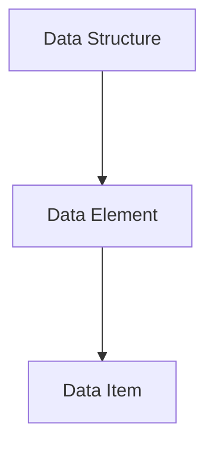

>[!note]
>I have already made a bunch of notes on Database;
>"*What really*?" Yes, I made some notes back when I was at [[University of Technology Mauritius Data View ( Level 1 Semester 1 ) | University of Technology Mauritius]].
>There the module was called "*Database Design*" but its basically the same thing.
>Head over to [[University of Technology Mauritius Data View ( Level 1 Semester 1 )#Database Design Folder | Database Design Folder ( UTM )]] to take a look at all the available things.

>One more thing that I would like to add; I will be updating those UTM Database Design notes is need be.
>*There will be these "if need be alot"*

## List of Contents

- [[Database Concepts Introduction#Basic Definitions | Basic Definitions]]
- [[Database Concepts Introduction#Organising Data | Organising Data]]
- [[Database Concepts Introduction#Database Management Systems | Database Management Systems]]

---

### My Links

- [[Database Concepts Introduction#Socials | Link to Socials]]

---

# Basic Definitions

>[!tip]- What is the meaning of Data?
>Raw facts and figures that are *recorded* and can be *accessed*.
>
>Data Formats:
>- Text
>- Numbers
>- Graphics ( Images / Videos )
>- Audio Recordings

>[!tip]- What is the meaning of Information?
>Refers to the data that is accessed by a user for some particular purpose.
>
>>[!info]
>>My definition is something that goes along that so:
>>>Data is meaningless and information is meaningful, because information is *processed* data ( processing of data )
>>
>>That's how I look at it!

>[!tip]- What is the definition of Metadata?
>It is the data that describes the structure and the properties of the data.
>>Basically its *data about the data*!

---

# Organising Data

- Data Model: Provides sets of principles for organising data
- Data Structure: Logical collection of element
- Data Element: Group of data item
- Data Item: Simplest element of data ( atomic )

## File Based Approach

>I have already some notes on that so not going to write the same shit again
>That is the reason why I use Obsidian!

- [[Database and Flat Files]]

$\uparrow$ Above is some notes on Database and Flat Files that I made when I was doing *Database Design*.

## Database Approach

>[!tip]- What is a Database?
>- A database is a *shared* collection of **logically** related data and a **description** of this data designed to meet the information *needs* of an organisation.
>- Collection of information that is **organised** so that it can be easily *accessed*, *managed* and *updated*.
>- **System Catalog** ( *metadata* ) provides the description of data to enable program-data independence.

---

# Database Management Systems

Again, I have a bunch of notes on this topic.

- [[Database Management System ( DBMS )]]

---

# Socials

- **Instagram**: https://www.instagram.com/s.sunhaloo
- **YouTube**: https://www.youtube.com/channel/UCMkQZsuW6eHMhdUObLPSpwg
- **GitHub**: https://www.github.com/Sunhaloo

---

S.Sunhaloo
Thank You!