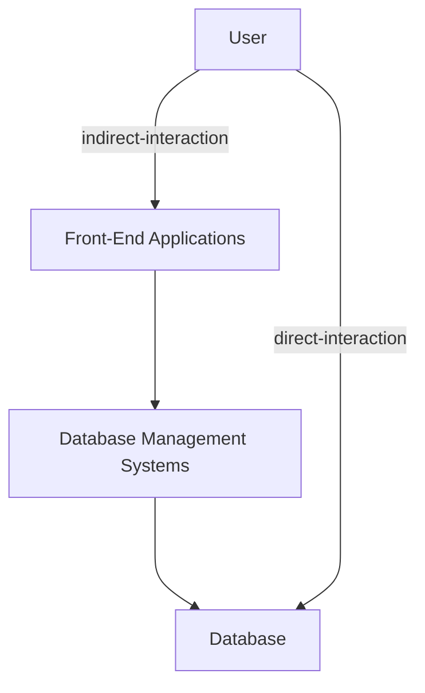

### My Links

- [[Database Systems - Tutorial 1#Socials | Link to Socials]]

---

Which of the following is a format in which data can appear?

- [ ] Text
- [ ] Numbers
- [ ] Images
- [x] All of the above

'FirstName' is an example of:

- [x] Data
- [ ] Metadata
- [ ] Data Type
- [ ] DBMS

Which of the following is a component of a database system?

- [ ] Database
- [ ] DBMS
- [ ] Front-end applications
- [x] All of the above

Database implementation involves using ... to implement the database model as an actual database

- [ ] Front-end applications
- [ ] DBMS
- [x] Database System
- [ ] Indirect Interaction

... are in charge of implementing the database model as a functioning database using the DBMS software

- [ ] Database analysts
- [ ] Database architects
- [ ] Database developers
- [x] DBAs

---

The term information refers to the data that is accessed by a user for some particular purpose: True

Indirect interaction requires that the end user know how to issue commands to the specific DBMS: False

The new version of a database is created following the same development steps as the initial version: True

A DBMS can be used for creation of databases: True

During a proper requirements collection process, the requirements can be added iteratively and implicitly: False

---

Explain the relationship between the terms data and information

Data are raw facts and figures while Information are processed data.

Example

The number '5' could mean anything; but 5 kilograms means that this number is related to mass

What is the purpose of a DBMS?

It's purpose is to help create and maintain computerised databases.

Illustrate a typical database system architecture

Describe the 2 types of interaction between the end user and the database

1. Direct Interaction

	- They make communications / changes to the database directly through the DBMS Software

3. Indirection Interaction

	- They make communications / changes to database through front-end applications

Using an example, describe the relationship between a DBMS and database

The database consists of related set of database that is centralised and structured a a computer system
While the database management system ( DBMS ) is used to create and maintain computerised databases.

---

# Socials

- **Instagram**: https://www.instagram.com/s.sunhaloo
- **YouTube**: https://www.youtube.com/channel/UCMkQZsuW6eHMhdUObLPSpwg
- **GitHub**: https://www.github.com/Sunhaloo

---

S.Sunhaloo
Thank You!