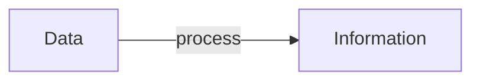

## List of Contents

---

### My Links

- [[Data and Information#Socials | Link to Social]]

---

# Data v/s Information

>Data $\neq$ Information

Even though, most people use data and information as synonyms. They are **not** the same thing.

>Obviously we have 2 different meaning for *data* and *information*

### How Data becomes Information

We need to understand how **data** becomes **information**. Take a look at the diagram below $\downarrow$:

### What is the "*process*"?

The "*process*" can be anything from:

1. Combination
2. Comparison
3. Calculations
4. Analysis

#### Example of Processing:

Data:

- Force: 100N
- Surface Area = L x W => 5 X 2 = $10 \ m^{2}$

Process:

- $Pressure = \frac{Force}{Area} \Rightarrow \ P = \frac{100}{10}$

Information:

Pressure = $10 \ Pa$

---

# Socials

- [**Instagram**](https://www.instagram.com/s.sunhaloo/)
- [**YouTube**](https://www.youtube.com/channel/UCMkQZsuW6eHMhdUObLPSpwg)
- [**GitHub**](https://www.github.com/Sunhaloo)

---

S.Sunhaloo
Thank You!