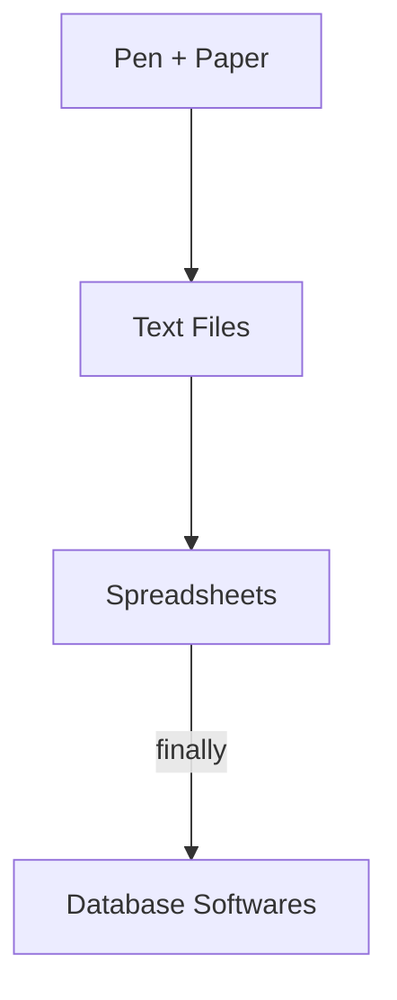

## List of Contents

- [[Database and Flat Files#Definitions| Definitions]]
- [[Database and Flat Files#What is a Flat File? | What is a Flat File?]]
	- [[Database and Flat Files#Then Why they were Used? | Why Flat Files were Used?]]
	- [[Database and Flat Files#Disadvantages of Flat File Processing | Disadvantages of Flat Files]]
- [[Database and Flat Files#What is a Database?| What is a Database?]]
	- [[Database and Flat Files#Types of Databases| Types of Databases]]
		- [[Database and Flat Files#Centralised Database| Centralised Database]]
		- [[Database and Flat Files#Distributed Database| Distributed Database]]
			- [[Database and Flat Files#Homogenous Databases| Homogenous Databases]]
			- [[Database and Flat Files#Heterogeneous Databases| Heterogeneous Databases]]
	- [[Database and Flat Files#Development Stages of Database System | Development Stages of Database System]]

---

### My Links

- [[Database and Flat Files#Socials| Link to Social]]

---

# Definitions

>[!tip]- Definitions
>- Data:
>	- It is known facts and figures that can be recorded and have implicit meaning.
>	- Example:
>		1. $2000
>		2. 666 People
>		3. 69%
>- Information:
>	- **Processed** *data* that has a meaning / function.
>	```mermaid
>	graph LR
>	A[Data] --->| process | B[Information]	
>	```
>- Database:
>	- A database consists of related set of data that is centralised and structured on a computer system.
>	- Inside a database; **data** is in its "*raw*" form.
>	>We also have an updated definition of Database check below $\downarrow$
>- Database Management System:
>	- It is a software / software package that can be used to create and maintain computerised databases.
>- Database System:
>	- It is a collection of the DBMS software together with the **data**.
>- File:
>	- It is a collection of records of **single** data type.

---

# What is a Flat File?

When people did not have **Computerised** and **Structured** database; we used to use regular old *pen* and *paper*.

But as you know, these are not great methods of **storing** and **retrieving** data.

When computer became accessible people started using *text files* then *spreadsheets*

So you could say that it went like this:



## Then Why they were Used?

>Could also count as Advantages

This is because of their ease of use and accessibility.

For Example:

- Pen + Paper: Can be used anywhere even without electricity
- Text File: Can be opened with any Operating System; even if you have CLI
- Spreadsheets: Organisation $\gt$ Text File; and easier to use than Databases.

## Disadvantages of Flat File Processing

- Program-Data Dependence
	- All program maintain metadata for each file they use
- Data Duplication / Redundancy
	- Having the multiple copies of the **same** data
- No / Limited Sharing
	- No centralised control of data
- Lengthy Development Times
	- Must design own file formats
- Excessive Program Maintenance
	- 80% of information systems budget

>If you reverse these *disadvantages* you get the **advantages** of Databases.

---

# What is a Database?

>[!tip] Definition ( University of Mauritius )
>A database is a shared collection of logically related data and a description of this data designed to meet the information needs of an organisation

>[!tip]- Definition
>A database consists of **related** set of **data** that is *centralised* and *structured* on a computer system.
>>What did people used when Computerised Databases did Not Exists?
>>They use flat files; basically some pen and paper or even Excel Sheets!
>>>[!warning]
>>>Excel is <span style="color: red;">NOT</span> is Database Software!!!

## Advantages / Facilities of Databases

- Retrieval of Data / Information
- Adding Data
- Modifying Data
- Deleting Data
- Queries ( *SQL the 'Q' part* )

It is also managed by a **[[Database Administrator]]**.

### Examples of Databases

>I do not really know that to add here; but just going to add things that I know of!

1. Password Managers
2. Airline Companies
3. Cloud Hosted Web Apps
	- Google
	- Spotify / SoundCloud
	- Social Media: Instagram, Reddit, Discord
4. Banks

### Why do We use Databases over Flat Files?

There are many advantages of using Computerised Databases over Flat Files.

- **No** duplication of data
- **No** redundancy of data
- Security of Data: Authorisation + <ins>Access Control</ins> $\Rightarrow$ related to **Views**
	- If something needs to be deleted; it needs to be deleted everywhere ( *easier to update* )
	- Backups
- Search / Queries
- Referential Integrity
	- Cannot accidentally delete / update something

---

# Types of Databases

## Centralised Database

As per the [Wikipedia](https://en.wikipedia.org/wiki/Centralized_database); Centralised Databases are stored in a **single** locations, usually on a central computer ( *desktop, server, mainframe computer* ).

A centralised database is normally used by organisations ( *businesses* ) or institutions ( *universities* )

>[!tip] Teacher's Notes
>Advantages
>- Data located at a **single** site
>- Accessed using telecom facilities
>- Greater control over accessing + updating
>
>Disadvantages
>- Vulnerable to failure

## Distributed Database

>In addition to types of databases; in **distributed** databases, we also have 2 generic categories
>Will be covering them below $\downarrow$

Again, as per our trusty [Wikipedia](https://en.wikipedia.org/wiki/Distributed_database). It is a database, in which the **data** ( *emphasis on data* ) is spread over various location

It may be stored in multiple computers in the **same** physical location or dispersed over a network of interconnected computers ( *like a small intranet* )

>[!tip] Teacher's Notes
>A single logical database spread physically across computers in multiple locations

### 2 Generic Categories

#### Homogenous Databases

>[!tip]- What is the actual definition of *Homogeneous*?
>>From HSC Physics; we learnt about homogeneous equations. They are equations where the SI units were equal on both sides.
>>But what is the actual definition?
>- Of the same kind; alike.

##### What is a Homogeneous Database?

A homogeneous database is one in which all the participating computers / servers *shares* the **same** Database Management System ( DBMS ).
These databases are unified and consistent view of data across all of these devices ( *computers / servers $\Rightarrow$ "nodes"* )

Some of the characteristics are:

- Uniformity
	- All devices uses the same DBMS software and possess identical database schemas
- Data Consistency
	- If one computer updates the database; it will be automatically updated on every single devices
- Simplicity
	- Easier to manage as same DBMS software is used everywhere
	- More simple data sharing

Where are Homogeneous Databases used?

1. Enterprise Applications
2. Cloud Computing
3. Financial Institution
4. Healthcare Systems
5. Inventory Management

>[!tip] Teacher's Notes
>- Database technology same at each of the locations
>	- OS is the same
>	- Data models are the same
>	- DBMS softwares are the same
>- Simplified Sharing of Data
>- High level of planning required

#### Heterogeneous Databases

>[!info]- What is the actual definition of *Heterogeneous*?
>- Diverse in character and content.

##### What is a Heterogeneous Database

Compared to Homogenous Databases; this one allows devices ( *again, computers and servers* ) in a distributed system to use different DBMS softwares and possess different database schemas
This is because is can cater to diverse requirements and facilitates seamless integration between *nodes* using different technologies

Some of the characteristics are:

- Flexibility
	- Devices can employ different types of DBMS softwares
- Schema Mapping $\rightarrow$ [[Overview of Database Management System 1#Mapping| Mapping]]
	- They necessitate different mappings between schemas to ensure the exchange and use of information between *nodes*
- Data Transformation / Translation
	- Data might need to be transformed or translated between different formats to maintain consistency

Where are Heterogeneous Databases used?

1. Internet of Things ( IoT ) and Big Data
2. Business Intelligence and Analytics
3. Federated Data Access

>[!tip] Teacher's Notes
>Databases evolve over time
>- Without planning
>- Different OSs
>- Different data models
>- Syntactic Differences ( *e.g: different data field representations* )
>- Semantic Differences

>[!note]- What is Schema Mapping?
>Process of establishing relationships between the elements of 2 different database schemas.

>[!info]- What is a Federated Database System ( FDBS )?
>Type of meta-database management system ( DBMS ), which transparently maps multiple autonomous database system into a federated database
>>[!tip] What does "*Federate*" means?
>>Form or be formed into a single centralised unit, within each organisation keeps some internal autonomy

---

## Development Stages of Database System

![[Steps in developing a Database System.png]]

The first and **most** <span style="color: orange;">critical</span> step in the development process is the *Requirements* process.

>Like I did with the [[Computer - Computer Spare Parts Shop Requirements]]

>[!info] Requirements Collection, Definition and Visualisation
>It results in the requirements specifying which data the future database system will hold and in what fashion, and what the capabilities and functionalities of the database system will be
>- The collected requirements should be clearly defined and stated in a written document, and then visualised
>- [[Data Modelling - Conceptual - Logical Level Modelling | Conceptual Database Model]] - Visualisation of requirements by using a conceptual data modelling technique like: [[Entity Relationship Diagram ( ERD ) and Relationships#What is an Entity Relationship Diagram? | Entity Relationship ( E-R ) Diagram]]
>- There are also Database Modelling which I have already made a note on: [[Data Modelling - Conceptual - Logical Level Modelling]]

>I have also covered the advantages and disadvantages of Database Management Systems over at
>[[Database Management System ( DBMS )]]

---

# Socials

- [**Instagram**](https://www.instagram.com/s.sunhaloo/)
- [**YouTube**](https://www.youtube.com/channel/UCMkQZsuW6eHMhdUObLPSpwg)
- [**GitHub**](https://www.github.com/Sunhaloo)

---

S.Sunhaloo
Thank You!