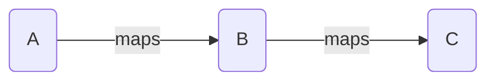

## List of Contents

- [[Sets, Functions and Relations#Algebra of Sets | Algebra of Sets]]
	- [[Sets, Functions and Relations#Power Sets $ wp$ | Power Sets]]
		- [[Sets, Functions and Relations#Power Set $ wp$ of $A$ | Power Set of A]]
	- [[Sets, Functions and Relations#Examples Power Set $ wp$ | Examples of Power Set]]
- [[Sets, Functions and Relations#Properties of Union $ cup$ | Properties of Union]]
	- [[Sets, Functions and Relations#Commutative Property of Union| Commutative Property of Union]]
	- [[Sets, Functions and Relations#Associative Property of Union | Associative Property of Union]]
- [[Sets, Functions and Relations#Properties of Intersection $ cap$ | Properties of Intersection]]
	- [[Sets, Functions and Relations#Commutative Property of Intersection | Commutative Property of Intersection]]
	- [[Sets, Functions and Relations#Associative Property of Intersection | Associative Property of Intersection]]
- [[Sets, Functions and Relations#Distributive Laws | Distributive Laws]]
- [[Sets, Functions and Relations#Complement Laws | Complement Laws]]
- [[Sets, Functions and Relations#De Morgan's Laws | De Morgan's Laws]]
	- [[Sets, Functions and Relations#Another Complement Law | Another Complement Law]]
- [[Sets, Functions and Relations#Cartesian Product | Cartesian Product]]
- [[Sets, Functions and Relations#Relations | Relations]]
	- [[Sets, Functions and Relations#Examples Relations | Examples of Relations]]
		- [[Sets, Functions and Relations#Equivalence Relation | Equivalence Relation]]
			- [[Sets, Functions and Relations#Examples Equivalence Relation | Examples of Equivalence Relations]]

---

### My Links

- [[Sets, Functions and Relations#Socials | Link to Social]]

---

# Algebra of Sets

## Power Sets $\wp$

If **set** $A$ has $n$ elements $\Rightarrow$ It has $2^{n}$ **Subsets**.

### Power Set $\wp$ of $A$

Set of all the subset include empty ( *Null $\emptyset$ set* )

$$P(A) \ \coloneq \ \{S : S \subseteq A\}$$

>[!info]
>$P(A) \ \Rightarrow$ Power Set of A
>$\coloneq \ \Rightarrow$ Defined As
>$: \ \Rightarrow$ Such That
>$\subseteq \ \Rightarrow$ Subset
>$\emptyset \ \Rightarrow$ Empty Set
>>The above $\uparrow$ means that *the power set of A is defined as the set of all subset S, such that S is a subset of A*.

#### Examples: Power Set $\wp$

1. Given $X = \{ a, b \}$, find the Power Set of set $X$

As we have 2 *variables* which are $a$ and $b$; we are going to have $2^{2} \Rightarrow$  4 Possibilities

Hence, we get the Answer:

$$P(X) \ = \ \{\emptyset, \{ a \}, \{ b \}, \{ a, b \} \}$$

2. Given $Y = \{ a, b, c \}$, find the Power Set of set $Y$

As we have 3 *variables* which are $a$, $b$ and $c$; we are going to have $2^{3} \Rightarrow$  8 Possibilities

Hence,

$$P(Y) \ = \ \{\emptyset, \{ a \}, \{ b \}, \{ c \}, \{ a, b \}, \{ a, c \}, \{ b, c \}, \{ a, b, c \} \}$$

>[!warning]
>There should be <strong>NO</strong> *repetition*!
>What I am trying to say is that we **cannot** have $\{ a, b \}$ **and** $\{ b, a \}$.

## Properties of Union $\cup$

>[!tip] What is Union $\cup$ in English?
>Union means "**OR**"

Take a look at this Venn Diagram below $\downarrow$

![[Simple 2 Sets Venn Diagram ( Union ).png | 300]]

$$A \cup B \coloneq \{ x : x \in A \ or \ x \in B \}$$

>You could say that "*A union B defines that $x$ such that $x$ is an element of A or $x$ is an element of B*"

### Properties

1. $A \subseteq A \cup B$
2. $B \subseteq A \cup B$

Take a look at the image above $\uparrow$; this is because in the set $A \cup B$ we have $1, 2, 3,$ and also set $A$ and set $B$ has the value of $\{ 1, 2 \}$ and $\{ 2, 3 \}$ **respectively**.
Hence the property applies.

#### Commutative Property of Union

3. $A \cup B = B \cup A$

>I think this does not need any explanation! Simple Enough!

#### Associative Property of Union

4. $( A \cup B ) \cup C = A \cup ( B \cup C )$

So now we are going to have 3 Sets; here is the Venn Diagram below $\downarrow$:

![[Simple 3 Sets Venn Diagram.png | 300]]

Let's go calculate!!!

$$
\begin{align}
\Rightarrow A \cup B = \{ 1, 2, 3, 4, 5, 6 \}
\\
\Rightarrow B \cup C = \{ 2, 3, 4, 5, 6, 7\}
\end{align}
$$

Hence, for each of them:

$$
\begin{align}
( A \cup B ) \cup C = \{ 1, 2, 3, 4, 5, 6, 7 \}
\\
A \cup ( B \cup C ) = \{ 1, 2, 3, 4, 5, 6, 7 \}
\end{align}
$$

As you can see, we the the **final** answer of $( A \cup B ) \cup C = A \cup ( B \cup C )$

## Properties of Intersection $\cap$

>[!tip] What is Intersection $\cap$ in English?
>Union means "**AND**"

Take a look at this Venn Diagram below $\downarrow$

![[Venn Diagram 2 Sets ( Intersection ).png | 300]]

$$A \cap B \coloneq \{ x : x \in A \ and \ x \in B \}$$

### Properties

1. $A \cap B \subseteq A$
2. $A \cap B \subseteq B$

Take a look at the image above $\uparrow$; as you can see Set $A$ and Set $B$ as value $\{ 1, 2\}$ and $\{ 2, 3\}$ respectively. If you take the intersection of $A$ and $B$; you will get the value of $\{ 2\}$.
As $2$ is in both Sets; the above property is True.

#### Commutative Property of Intersection

3. $A \cap B = B \cap A$

>Simple Enough; I think so!!!

#### Associative Property of Intersection

4. $( A \cap B ) \cap C =  A \cap ( B \cap C )$

Again, we are going to have 3 Sets.

![[Simple 3 Sets Venn Diagram.png | 300]]

Let's start calculating the left hand side and the right hand side

$$( A \cap B ) = \{ 2, 5 \}$$
$$\Rightarrow ( A \cap B ) \cap C = \{ 5 \} \leftarrow$$

$$( B \cap C ) = \{ 5, 6 \}$$
$$\Rightarrow ( B \cap C ) \cap A = \{ 5 \} \leftarrow$$

As you can see; both equations will lead to the **same** answer.

## Distributive Laws

>The following "*content*" is mostly proving things
>NOTE: We need to know how to show the proofs!!!

1. $A \cap ( B \cup C ) = ( A \cap B ) \cup ( A \cap C)$
2. $A \cup ( B \cap C ) = ( A \cup B) \cap ( A \cup C )$

>[!note]
>There is a graphical method that you can use prove it; But I am not going to be including that as it is going to be wasting my time ( *time not spent typing LaTex and instead drawing* ).
>In addition, we only need to prove it "*not*" graphically in exams.
>Nevertheless, if you want to use the graphical method, you can make 3 Sets and then add some values inside and then finally perform the calculations!

>[!tip] Prove $A \cap ( B \cup C ) = ( A \cap B ) \cup ( A \cap C)$
>Let $x \in A \cap ( B \cup C )$
>$x \in A \ and \ x \in ( B \cup C )$
>$x \in A \ and \ ( x \in B \ or \ x \in C )$
>$( x \in A \ and \ B ) \ or \ ( x \in A \ and \ C )$
>Final Answer:
>$( A \cap B ) \cup ( A \cap C )$
>$A \cap ( B \cup C ) = ( A \cap B ) \cup ( A \cap C) \ \leftarrow$, Hence Proved

>[!tip] Prove $A \cup ( B \cap C ) = ( A \cup B ) \cap ( A \cup C)$
>Let $x \in A \cup ( B \cap C )$
>$x \in A \ or \ x \in ( B \cap C )$
>$x \in A \ or \ ( x \in B \ and \ x \in C )$
>$( x \in A \ or \ B ) \ and \ ( x \in A \ or \ C )$
>Final Answer:
>$( A \cup B ) \cap ( A \cup C )$
>$A \cup ( B \cap C ) = ( A \cup B ) \cap ( A \cup C) \leftarrow$, Hence Proved

## Complement Laws

Given $A \Rightarrow A^{'}$

This ( $A^{'}$ ) simply means that all the elements that are **not** present in A

$$A \cap B^{'} \coloneq \{ x : x \in A \ and \ x \notin B \}$$

>[!info]
>$A \cap B^{'}$ can be written as $A - B$
>>[!warning]
>>This is also possible:
>>$B \cap A^{'} \rightarrow B - A$
>>
>>This is NOT possible:
>>$A^{'} \cap B \Rightarrow$ NOT Possible!!!

## De Morgan's Laws

1. $( A \cup B )^{'} = A^{'} \cap B^{'}$
2. $( A \cap B )^{'} = A^{'} \cup B^{'}$

>[!warning]
>Be careful of the \cap and \cup; they are **swapped** when doing "*inverse*".

>[!note]
>Again, there is a graphical method that you can use to do the proving... But as I said; I will be wasting my time.

>[!tip] Prove $( A \cup B )^{'} = A^{'} \cap B^{'}$
>Let $x \in ( A \cup B )^{'}$
>`or` $\rightarrow$ `and` $\Rightarrow$ swapped!!!
>$x \notin A \ and \ x \notin B$
>$x \in A^{'} \ and \ x \in B^{'}$
>$x \in A^{'} \ and \ B^{'}$
>$x \in A^{'} \cap B^{'}$

>[!tip] Prove $( A \cap B )^{'} = A^{'} \cup B^{'}$
>Let $x \in ( A \cap B )^{'}$
>`and` $\rightarrow$ `or` $\Rightarrow$ swapped!!!
>$x \notin A \ or \ x \notin B$
>$x \in A^{'} \ or \ x \in B^{'}$
>$x \in A^{'} \ or \  B^{'}$
>$x \in A^{'} \cup B^{'}$

## Another Complement Law

>I don't really know but we had another "*heading*" that we wrote that is the same as above $\uparrow$

1. $A - ( B \cup C ) = ( A - B ) \cap ( A - C )$
2. $A - ( B \cap C ) = ( A - B ) \cup ( A - C )$

>[!warning] Notice how $\cup \ \rightarrow \ \cap$ and Vice Versa
>>[!info]
>>We can also say that $- =$ `and`!

>[!tip] Prove $A - ( B \cup C ) = ( A - B ) \cap ( A - C )$
>Let $x \in A - ( B \cup C )$
>$x \in A \ and \ x \notin ( B \cup C )$
>>Swapping $\cup$ for $\cap$ because of '$-$'
>
>$x \in A \ and \ ( x \notin B \cap x \notin C )$
>$( x \in A \ and \ x \notin B ) \ and \ ( x \in A \ and \ x \notin C )$
>$( x \in A - B ) \ and \ ( x \in A - C )$
>$\Rightarrow x \in ( A - B ) \cap ( A - C )$

>[!tip] Prove $A - ( B \cap C ) = ( A - B ) \cup ( A - C )$
>Let $x \in A - ( B \cap C )$
>$x \in A \ and \ x \notin ( B \cap C )$
>>Swapping $\cap$ for $\cup$ because of '$-$'
>
>$x \in A \ and \ ( x \notin B \cup x \notin C )$
>$( x \in A \ and \ x \notin B ) \ or \ ( x \in A \ and \ x \notin C )$
>$(x \in A - B ) \ or \ ( x \in A - C )$
>$\Rightarrow x \in ( A - B ) \cup ( A - C )$

# Cartesian Product

Let Set $A$ and Set $B$ be **non-empty** $\emptyset$ Sets. Then, the cartesian product of $A$ and $B$ is denoted as:

$$A \times B$$

$$A \times B \coloneq \{ \{x, y\}: x \in A \ and \ x \in B \}$$

>[!note]
>The ordered pair can be written as $( x , y )$ **or** $< x, y >$!

## Examples: Cartesian Product

1. Given $A = \{ 2, 3 \}$ and $B = \{ 4, 5, 6 \}$; Find $A \times B$.

$A \times B = \{ (2, 4), (2, 5), (2, 6), (3, 4), (3, 5), (3, 6) \}  \ \leftarrow$

2. If $E = \{ 5, 6 \}$, $F = \{ 1, 3 \}$ and $G = \{ u, r, v \}$; find:
	1. $E \times F$
	2. $F \times F$
	3. $E \times G$

- $E \times F = \{ (5, 1), (5, 3), (6, 1), (6, 3) \}$
- $F \times F = \{ (1, 1), (1, 3), (3, 1), (3, 3) \}$
- $E \times G = \{ (5, u), (5, r), (5, v), (6, u), (6, r), (6, v) \}$

3. Find $A \times B$; given $A = \{ x \in z : 2x-3 = 7 \}$ and $B = \{ x \in z : x^{2} - 10x + 24 = 0 \}$

>[!note]- Note
>$z$ represents a **set of integers**

We are not going to factorise and solve for $x$!

$A = \{ x \in z : x = 5 \}$

You can use normal *product-sum* or *quadratic formula* to solve for $x \ \downarrow$

$B = \{ x \in z : x = 6 \ and \ x = 4 \}$

- $A = \{ 5 \}$
- $B = \{ 4, 6 \}$
- $A \times B = \{ (5, 4), (5, 6) \}$

# Relations

A relation $R$ between 2 Sets $A$ and $B$ is a collection of ordered pairs containing 1 object from each Set $A$ and $B$.

Let $x \in A$ and $y \in B$. If $x$ is related to y by the relation $R$, then we write $x \ R \ y$

$$R \coloneq \{ (x, y) : x \in A , y \in B \ and \ x \ R \ y \}$$

### Reflexive

>[!tip]
>We know that for a relation to be **reflexive**; we need the contents to *relate* to itself.

Consider the following relation of the Set $\{ 1,2, 3, 4 \}

Now, write the [[Sets, Functions and Relations#Cartesian Product | ordered pair]] to show *reflexive* relation.

$$R_{1} = \{ (1, 1), (1, 2), (1, 4), (2, 1), (2, 2), (3, 3), (4, 1), (4, 4) \}$$
$$R_{2} = \{ (1, 1), (1, 2), (1, 3), (1, 4), (2, 2), (2, 3), (2, 4), (3, 3), (3, 4), (4, 4) \}$$

Because in the 2 relation above $\uparrow$ we have ordered pairs like $(1, 1), (2, 2), (3, 3), (4, 4)$; we can say that it is **Reflexive**

>[!note]
>There are more ordered pairs that we can have for the relation in the example above $\uparrow$.

### Symmetric

A relation $R$ on Set $A$ is called *symmetric* if $(a, b) \in R$ whenever $(b, a) \in R$, for all $a, b \in A$.

### Transitive

A relation $R$ on Set $A$ is called *transitive* if whenever $(a, b) \in R$ and $(b, c) \in R$, then $(a, c) \in R$ for all $a, b, c \in A$.

## Examples: Relations

1. Given $A = \{ 2, 3 \}$ and $B = \{ 4, 5, 6 \}$. A relation from Set $A$ to Set $B$ is defined as:
	$a \ R \ b \ \Longleftrightarrow \ a \ divides \ b \ and \ ( a \in A, b \in B )$
	Write down the ordered pair of the solution

>[!bug] Warning
>Pay **massive** attention to **a** *divides* **b**; this is because in our ordered pair; we need it be in this format $( a, b )$.

$$\Rightarrow R = \{ (2, 4), (2, 6), (3, 6) \} \leftarrow$$

2. Given $X = \{ 1, 2, 3 \}$
	>A relation from Set $X$ to Set $X$; is simply called a "*relation on Set $X$*"
	A relation is setup so that Set $X$ *maps* onto itself
	$x \ R \ y \Longleftrightarrow \ x \lt y \ and \ ( x \in X, y \in X )$
	
>[!bug] Warning
>Pay **massive** attention to **x** $\lt$ **y**; this is because in our ordered pair; we need it be in this format $( x, y )$.

$$\Rightarrow x = 1, 2, 3 \ and \ y = 1, 2, 3$$
$$\Rightarrow R = \{ (1, 2), (1, 3), (2, 3) \} \leftarrow$$

## Equivalence Relation

>Found on Page 545 ( *actual book page = 519* ) in the Book "*Discrete Mathematics and Its Applications*" by Kenneth H.Rosen.

A relation $R$ on a Set $X$ is said to be an equivalence relation if for any $a, b c \in X$:

1. $a \ R \ a \ \leftarrow$ Reflexive
2. $a \ R \ b \Rightarrow b \ R \ a \leftarrow$ Symmetric
3. $a \ R \ b \ and \ b \ R \ c \Rightarrow a \ R \ c \leftarrow$ Transitive

### Examples: Equivalence Relation

#### Example 1: Parallel Lines

Let $X$ be a Set of all straight lines in the Cartesian Plane. A relation $R$ is defined as:

$$x \ R \ y \Longleftrightarrow x \ \| \ y$$

#### Solution

![[Equivalence Relation Cartesian Plane ( Parallel Lines ).png | 300]]

For any $x, y, z \in X$

- Case: Reflexive

$x \ R \ x$ as $x$ is $\|$ to itself; therefore **Reflexive**

- Case: Symmetric

$x \ R \ y \Rightarrow x \ \| y$ a
	$\Rightarrow y \ \| \ x$
	$\Rightarrow y \ R \ x \leftarrow$ Symmetric

- Case: Transitive

$x \ R \ y$ and $x \ R \ z$
	$\Rightarrow x \ \| \ y \ and \ y \ \| \ z$
	$\Rightarrow x \ \| \ z \leftarrow$ Transitive

#### Example 2: Simple Example

A relation $R$ is defined as: $x \ R \ y \Longleftrightarrow x = y$. Show that $R$ is an equivalence relation.

- Case: Reflexive

$\Rightarrow$ if $x \ R \ x \ \leftarrow$ Reflexive

- Case: Symmetric

$\ x \ R \ y \Rightarrow x = y \ and \ y = x \ \leftarrow$ Symmetric

>[!note]-
>The **relation** ( $R$ ) is *Symmetric*; in this case we have $x = y$, meaning for the relation to exists; we need to have both values (  *i.e $x$ and $y$*) to be *equal*.
>But this is not always the case.

- Case: Transitive

$x \ R \ y \ and \ y \ R \ z \Rightarrow \ x = y, y = z$
	$\Rightarrow x = z$
	$\Rightarrow \ R$ is transitive

#### Example 3: Complicated Example

Show that the relation $R$ is an equivalence relation in the set $A = \{ 1, 2, 3, 4, 5 \} given by the relation.

$$R = \{ (a, b) = | a - b | \ is \ even \}$$

>[!tip] Answer
>$R = \{ (a, b) : | a - b | \ is \ even \}$ where $a \in A, b \in B$

##### Proofs

- Case: Reflexive

$| a - a | = | 0 | = 0 \Rightarrow$ always even ( _because 0 is **even**_ )
Thus, $| a - a |$ is even

Therefore $( a, a )$ belongs to the relation $R$

>$(a, a) = | a - a | = a \ R \ a$

- Case: Symmetric

$| a - b | = | b - a |$ because $| a - b | = | - ( b - a ) | = | b - a |$

>[!warning]
>I do not really know if this is actually good, ask someone!
>I think $| - ( b - a ) | = | b - a|$ because it takes the modulus of it.

Therefore, if $| a - b |$ is **even** $\Rightarrow \ | b - a |$ also **even**.

Hence, $( a, b ) \in R$, then $( b, a )$ belong to $R$.

- Case: Transitive

If $| a - b |$ is even; then $| a - b |$ is even. Similarly, if | b - c | is even, then $| b - c |$ is also **even**

>Sum of even numbers are also even!

$\Rightarrow a - b + b - c$ is even
	$\Rightarrow a - c =$ **even**

Hence, $| a - c |$ is also **even**.

$\leftarrow$ Therefore, if $(a, b) \in R$ and $(b, c) \in R$, then $(a, c)$ also **belongs** to $R$.

## Composition of Relation

Let $A$, $B$ and $C$ be 3 Sets!

Suppose $R$ is a relation from $A$ to ( $\rightarrow$ ) $B$ and $S$ is a relation from $B$ to $C$ <u>if and only if</u> $b \in B$ such that $a \ R \ b$ and $b \ R \ c$.

![[Composition of Relation - Week 2.png | 400]]

$$\Rightarrow RoS = \{ (a, ii), (c, i), (d, iv) \}$$

### Examples: Composition of Relation

#### Example 1: Simple Example 1

Given:

1. $X = \{ 4, 5, 6 \}$
2. $Y = \{ a, b, c \}$
3. $Z = \{ L, M, N \}$

Consider the *Relations*:

- $R_{1}$ From $X \rightarrow Y$
- $R_{2}$ From $Y \rightarrow Z$

Find $R_{1}$ and $R_{1}$.

>Simply write the **Ordered Pairs**

$$R_{1} = \{ (4, a), (4, b), (4, c), (5, a), (5, b), (5, c), (6, a), (6, b), (6, c) \}$$
$$R_{2} = \{ (a, L), (a, M), (a, N), (b, L), (b, M), (b, N), (c, L), (c, M), (c, N) \}$$

Hence we are going to get the answers:

$$\Rightarrow R_{1} o R_{2} = \{ (4, L), (4, M), (4, N), (5, L), (5, M), (5, N), (6, L), (6, M), (6, N) \} \leftarrow$$

---

# Socials

- **Instagram**: https://www.instagram.com/s.sunhaloo/
- **YouTube**: https://www.youtube.com/channel/UCMkQZsuW6eHMhdUObLPSpwg
- **GitHub**: https://www.github.com/Sunhaloo

---

S.Sunhaloo
Thank You!
